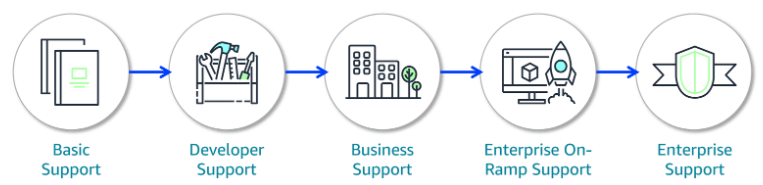

# Planes de Soporte en AWS

AWS ofrece una variedad de planes de soporte para acompañarte en cada etapa de tu viaje en la nube, desde proyectos personales hasta operaciones empresariales críticas. Cada plan suma más beneficios, herramientas y tiempos de respuesta más rápidos.

## Tipos de planes de soporte

- **Basic Support:** Incluido para todos los clientes, sin costo. Acceso a documentación, foros, whitepapers, AWS Trusted Advisor (chequeos básicos) y el AWS Personal Health Dashboard.
- **Developer Support:** Ideal para quienes están experimentando o desarrollando. Incluye todo lo anterior y soporte técnico por correo electrónico, con respuesta en menos de 24 horas (o 12 si hay sistemas afectados).
- **Business Support:** Recomendado para cargas de trabajo en producción. Añade soporte telefónico 24/7, acceso completo a Trusted Advisor, y tiempos de respuesta de hasta 4 horas (sistema afectado) o 1 hora (sistema caído). Incluye acceso a gestión de eventos de infraestructura.
- **Enterprise On-Ramp y Enterprise Support:** Pensado para operaciones críticas. Ofrece los tiempos de respuesta más rápidos (hasta 15 minutos), acceso a un pool o un TAM (Technical Account Manager) dedicado, recomendaciones personalizadas y soporte proactivo.

## Recursos adicionales de soporte

Además de los planes, AWS pone a tu disposición otros recursos:

- **AWS re:Post:** Comunidad de preguntas y respuestas, con artículos y videos del AWS Knowledge Center.
- **AWS Trust and Safety Center:** Para reportar actividades sospechosas o abusivas.
- **AWS Solutions Architects:** Asesoría técnica y de arquitectura para clientes Business y Enterprise.
- **AWS Professional Services:** Consultoría especializada para migraciones, auditorías, optimización y más.
- **Documentación y autoayuda:** Guías, blogs, whitepapers y tutoriales para resolver dudas por tu cuenta.

## AWS Marketplace y AWS Partner Network

- **AWS Marketplace:** Catálogo digital con miles de soluciones de software de terceros, listas para probar, comprar y desplegar en AWS. Incluye opciones gratuitas y de pago, y modelos flexibles como pago por uso o suscripción anual. Facilita la adquisición, despliegue y gestión de software especializado.
- **AWS Partner Network (APN):** Comunidad global de empresas tecnológicas y consultoras que crean soluciones sobre AWS. Puedes trabajar con partners para resolver retos específicos, acceder a eventos, capacitaciones y beneficios de financiamiento.

---

Con todos estos recursos y opciones de soporte, AWS te acompaña en cada paso, ayudándote a resolver problemas, optimizar tus soluciones y acelerar la innovación en la nube.
