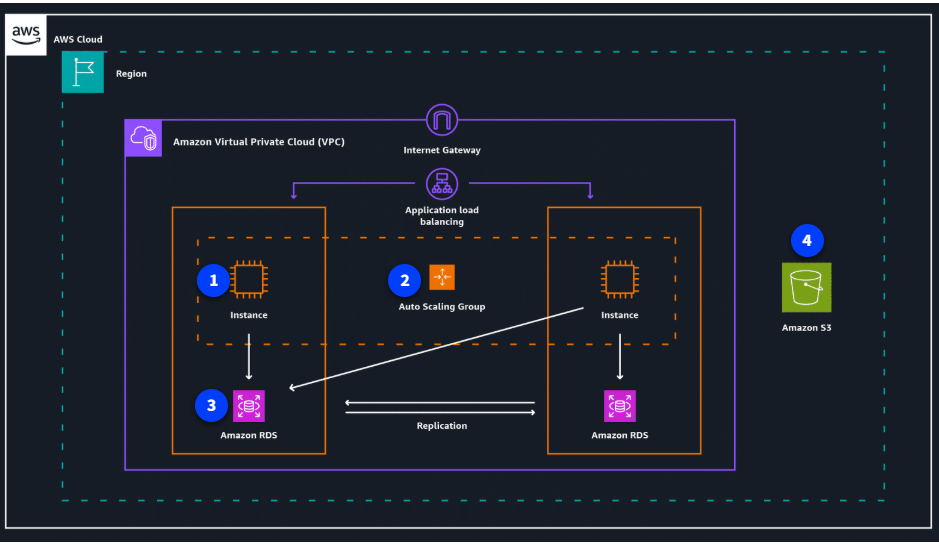

# Optimización de Costos en la Nube: Ejemplo Práctico

Ahora que ya conoces los fundamentos de precios y soporte en AWS, es momento de ver cómo aplicar técnicas de optimización de costos en un escenario real. Aquí tienes un resumen de las mejores prácticas y ejemplos para ahorrar en tu arquitectura en la nube.

## Técnicas clave de optimización de costos

### 1. Rightsizing (Dimensionamiento adecuado)

Asegúrate de que los recursos que usas (como instancias EC2 o bases de datos RDS) se ajusten a las necesidades reales de tu carga de trabajo. Herramientas como **AWS Compute Optimizer** te ayudan a identificar recursos sobredimensionados o infrautilizados.

### 2. Uso de Spot Instances

Para cargas de trabajo flexibles, las **Spot Instances** de EC2 pueden reducir costos hasta un 90% respecto al precio On-Demand. Son ideales para tareas que pueden ser interrumpidas y reiniciadas sin problema.

### 3. Auto Scaling y limpieza de recursos

Implementa **Auto Scaling** para ajustar automáticamente la cantidad de recursos según la demanda. Además, revisa y elimina recursos no utilizados (volúmenes EBS, snapshots, instancias detenidas) para evitar gastos innecesarios.

### 4. Optimización en Amazon RDS

Dimensiona correctamente tus bases de datos y aprovecha **read replicas** para distribuir la carga de lecturas, evitando escalar a instancias más grandes. Usa **caching** (por ejemplo, con Amazon ElastiCache) para reducir la presión sobre la base de datos principal.

### 5. Clases de almacenamiento y políticas en S3

Elige la clase de almacenamiento adecuada en **Amazon S3** según la frecuencia de acceso a los datos (por ejemplo, S3 Glacier para archivos históricos, S3 Intelligent-Tiering para patrones variables). Aplica políticas de ciclo de vida para eliminar versiones antiguas o datos obsoletos automáticamente.

### 6. Optimización de transferencia de datos

Minimiza el tráfico entre zonas de disponibilidad y hacia internet. Usa **VPC endpoints** para conectar servicios dentro de tu VPC sin pasar por la red pública, lo que puede reducir costos de transferencia.

## Ejemplo de arquitectura optimizada

Imagina una aplicación que utiliza EC2, RDS y S3 dentro de una VPC. Puedes ahorrar aplicando:

- Instancias EC2 rightsized y uso de Spot para tareas flexibles.
- Auto Scaling para ajustar recursos automáticamente.
- RDS con read replicas y caché para eficiencia.
- S3 con clases de almacenamiento adecuadas y políticas de ciclo de vida.
- VPC endpoints para reducir costos de transferencia.

Cada pequeña optimización suma y puede representar grandes ahorros a largo plazo, además de mejorar el rendimiento y la confiabilidad de tus soluciones en la nube.

---

¡Recuerda revisar periódicamente tus recursos y aprovechar las herramientas de AWS para mantener tus costos bajo control sin sacrificar la eficiencia!
