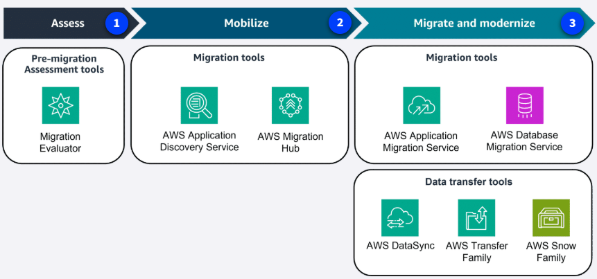

# Introducción a la Migración a la Nube

Migrar a la nube significa trasladar los activos digitales, aplicaciones y bases de datos de una organización desde infraestructuras locales (on-premises) hacia AWS. Este proceso requiere planificación estratégica, ejecución por etapas y gestión continua para lograr una transición exitosa y sin sobresaltos.

No importa si tu empresa está comenzando en la nube, ya tiene infraestructura local o incluso usa otro proveedor: siempre puedes migrar tus cargas de trabajo a AWS. Para facilitar este camino, AWS propone un proceso de migración en tres fases, apoyado por herramientas y servicios especializados.

## Las tres fases de la migración

1. **Evaluar (Assess):** Analiza la preparación de tu organización para operar en la nube, identifica objetivos y construye el caso de negocio. Herramientas como **Migration Evaluator** ayudan a estimar costos y beneficios.

2. **Movilizar (Mobilize):** Prepara la organización y los recursos necesarios. Aquí se identifican dependencias entre aplicaciones y se define la estrategia de migración. Servicios como **AWS Application Discovery Service** y **AWS Migration Hub** son clave en esta etapa.

3. **Migrar y modernizar (Migrate and Modernize):** Es el momento de mover y transformar las aplicaciones. Se utilizan herramientas como **AWS Application Migration Service**, **AWS Database Migration Service (DMS)**, **AWS DataSync**, **AWS Transfer Family** y **AWS Snow Family** para facilitar la migración y modernización.

Durante todo el proceso, puedes apoyarte en especialistas y partners de AWS, o bien avanzar con tu propio equipo. Recuerda que la migración suele ser iterativa y cada fase puede repetirse o ajustarse según las necesidades del negocio.

---

En las siguientes lecciones, profundizaremos en los servicios y mejores prácticas para cada fase de la migración a AWS.
