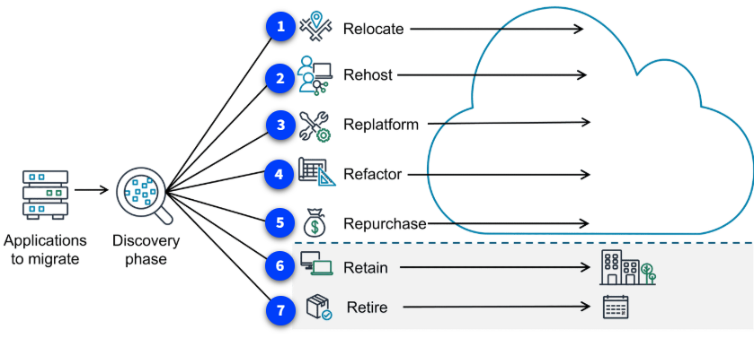

# AWS Cloud Adoption Framework y Estrategias de Migración

Migrar a la nube no es solo una cuestión técnica: implica personas, procesos y objetivos de negocio. Para ayudarte, AWS desarrolló el **Cloud Adoption Framework (CAF)**, que organiza las mejores prácticas y roles clave en seis perspectivas:

## Las seis perspectivas del AWS CAF

1. **Business (Negocio):** Alinea la estrategia de TI con los objetivos del negocio. Incluye gerentes, finanzas y responsables de presupuesto.
2. **People (Personas):** Gestiona el cambio organizacional, identifica necesidades de capacitación y estructura de equipos. Involucra recursos humanos y líderes de personal.
3. **Governance (Gobernanza):** Asegura que los procesos y habilidades estén alineados para maximizar valor y minimizar riesgos. Incluye CIOs, arquitectos empresariales y analistas.
4. **Platform (Plataforma):** Se enfoca en la arquitectura técnica y la migración de cargas de trabajo. Participan CTOs, arquitectos de soluciones y responsables de TI.
5. **Security (Seguridad):** Garantiza visibilidad, control y cumplimiento de los objetivos de seguridad. Involucra CISOs y equipos de seguridad.
6. **Operations (Operaciones):** Define cómo operar, mantener y recuperar cargas de trabajo en la nube. Incluye gerentes y equipos de soporte de operaciones.

Cada perspectiva ayuda a identificar brechas y a crear un plan de acción para una migración exitosa y sostenible.

---

## Las siete estrategias de migración (7 Rs)

Cuando migras aplicaciones a AWS, puedes elegir entre siete estrategias, conocidas como los **7 Rs**. Cada una se adapta a diferentes necesidades y tipos de aplicaciones:

1. **Rehost (Lift and Shift):** Mueve aplicaciones tal cual, sin cambios. Es rápido y sencillo, ideal para migraciones masivas.
2. **Relocate:** Cambia la ubicación de alojamiento, por ejemplo, moviendo VMs o contenedores directamente a la nube.
3. **Replatform (Lift, Tinker, and Shift):** Realiza pequeñas optimizaciones para aprovechar la nube, sin modificar el código fuente.
4. **Refactor (Rearchitect):** Rediseña la aplicación para aprovechar al máximo los servicios cloud. Requiere más esfuerzo, pero puede traer grandes beneficios.
5. **Repurchase (Drop and Shop):** Sustituye software tradicional por soluciones SaaS en la nube.
6. **Retain:** Mantén ciertas aplicaciones en su entorno original si no es el momento adecuado para migrarlas.
7. **Retire:** Elimina aplicaciones que ya no son necesarias, reduciendo costos y complejidad.

Normalmente, una organización usará una combinación de estas estrategias según el tipo de aplicación, objetivos y recursos disponibles. Elegir la estrategia adecuada para cada caso es clave para una migración exitosa y eficiente.

---

Con el AWS CAF y los 7 Rs, puedes planificar y ejecutar tu migración a la nube de forma estructurada, minimizando riesgos y maximizando beneficios para tu organización.
