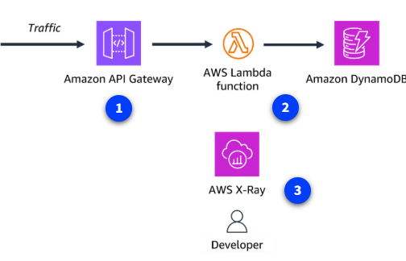
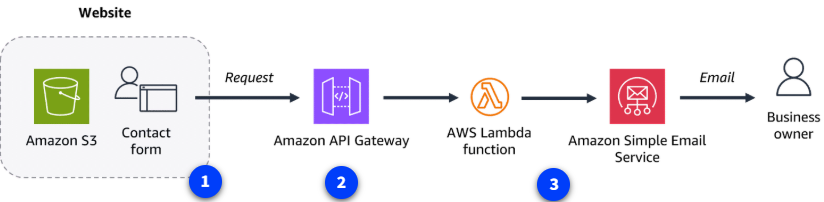
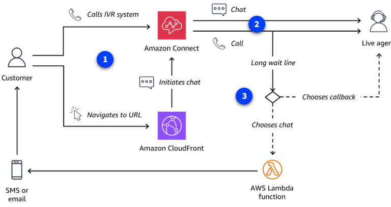

# Casos de Uso Especializados en AWS

AWS permite combinar servicios gestionados para crear soluciones a medida, desde arquitecturas serverless hasta sistemas inteligentes de atención al cliente. Aquí tienes ejemplos prácticos:

## Backend web serverless monitoreado con X-Ray

Una arquitectura típica para aplicaciones modernas:

- **Amazon API Gateway** recibe y valida solicitudes HTTP.
- **AWS Lambda** ejecuta la lógica de negocio y consulta **DynamoDB** para almacenar o recuperar datos.
- **AWS X-Ray** monitoriza y traza todo el recorrido de la petición, facilitando la detección de problemas.

## Sitio web estático con formulario de contacto

Ideal para páginas informativas o landing pages:

- **Amazon S3** aloja el sitio web estático y el formulario de contacto.
- **API Gateway** recibe los envíos del formulario.
- **Lambda** procesa la solicitud y usa **Amazon SES** para enviar correos electrónicos al propietario del sitio.

## Atención al cliente con opción de devolución de llamada

Solución para centros de contacto modernos:

- **Amazon Connect** gestiona llamadas y mensajes, integrando IVR y opciones de contacto.
- **CloudFront** puede enrutar mensajes de texto.
- **Lambda** permite a los clientes elegir devolución de llamada o cambiar a chat, evitando largas esperas.

---

Estos ejemplos muestran cómo, combinando solo unos pocos servicios especializados de AWS, puedes resolver necesidades empresariales complejas de forma escalable, eficiente y sin preocuparte por la infraestructura subyacente.
