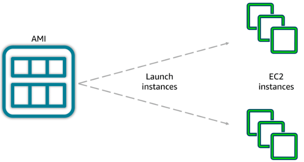
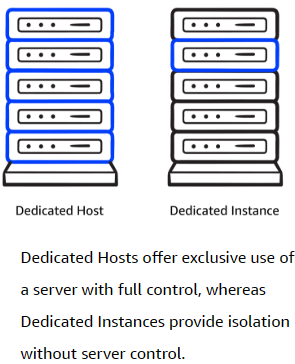

# Tipos de instancias EC2 y cómo interactuar con AWS

Amazon EC2 ofrece una variedad de tipos de instancias, cada una optimizada para diferentes necesidades. Elegir el tipo correcto te permite optimizar el rendimiento y el costo de tus aplicaciones.

## Tipos de instancias EC2

Visualiza los tipos de instancia como diferentes máquinas de café en una cafetería: cada una sirve para un propósito específico.

1. **General purpose (Propósito general):**
   - Balance entre CPU, memoria y red.
   - Ideal para servidores web, repositorios de código y cargas de trabajo variadas.
2. **Compute optimized (Optimizada para cómputo):**
   - Más CPU por dólar.
   - Útil para tareas intensivas en procesamiento, como servidores de juegos, HPC, machine learning y modelado científico.
3. **Memory optimized (Optimizada para memoria):**
   - Más memoria RAM.
   - Perfecta para bases de datos, análisis de datos y procesamiento de grandes volúmenes en memoria.
4. **Accelerated computing (Cómputo acelerado):**
   - Usan aceleradores de hardware como GPUs.
   - Ideales para cálculos matemáticos complejos, procesamiento gráfico y machine learning.
5. **Storage optimized (Optimizada para almacenamiento):**
   - Alto rendimiento para almacenamiento local.
   - Recomendadas para bases de datos grandes, data warehousing y aplicaciones con mucho I/O.

> **Consejo:** Elige el tipo y tamaño de instancia que mejor se adapte a tu carga de trabajo y presupuesto. Puedes cambiar de tipo o tamaño cuando lo necesites.

---

## ¿Cómo interactuar con AWS?

Todas las acciones en AWS se realizan mediante llamadas a APIs. Hay tres formas principales de interactuar con los servicios:

1. **AWS Management Console:**
   - Interfaz web visual y fácil de usar.
   - Ideal para principiantes y tareas manuales.
2. **AWS CLI (Command Line Interface):**
   - Permite gestionar servicios desde la terminal.
   - Útil para automatización y scripts.
3. **AWS SDK:**
   - APIs para lenguajes de programación (Python, Java, .NET, etc.).
   - Permite integrar AWS en tus aplicaciones.

> **Ejemplo:** Puedes lanzar una instancia EC2 desde la consola, con un comando en la CLI, o desde un script en Python usando el SDK.

---

## Responsabilidad compartida y servicios gestionados

En Amazon EC2 (servicio no gestionado), tú eres responsable de la configuración de seguridad, el sistema operativo, actualizaciones y firewalls (security groups). AWS se encarga de la infraestructura física y la virtualización.

En servicios gestionados (como AWS Lambda o RDS), AWS asume más responsabilidades, como la administración del sistema operativo y parches de seguridad.

**Resumen:**

- Elige el tipo de instancia EC2 según tu carga de trabajo.
- Usa la consola, CLI o SDK para interactuar con AWS.
- Entiende tus responsabilidades de seguridad según el tipo de servicio.

# Demo: Lanzamiento de una instancia EC2

Para lanzar una instancia EC2, debes configurar varios parámetros clave:

1. **Nombre de la instancia:** Para identificarla fácilmente.
2. **AMI (Amazon Machine Image):** Es una plantilla que define el sistema operativo, el software preinstalado y la configuración base. Puedes usar AMIs prediseñadas, crear las tuyas propias o adquirirlas en AWS Marketplace.
3. **Tipo de instancia:** Define la cantidad de CPU, memoria y red.
4. **Par de claves:** Para acceder de forma segura a la instancia (SSH o RDP).
5. **Red y seguridad:** Configura el acceso (por ejemplo, permitir tráfico HTTP para un servidor web).
6. **Almacenamiento:** Elige el tamaño y tipo de disco (por ejemplo, 8 GB gp3 EBS).
7. **User Data:** Permite ejecutar scripts al iniciar la instancia (por ejemplo, instalar un servidor web automáticamente).

**Flujo básico:**

1. Elige la AMI y el tipo de instancia.
2. Configura red, almacenamiento y claves.
3. Lanza la instancia y accede a ella.
4. (Opcional) Usa User Data para automatizar configuraciones iniciales.

## ¿Por qué usar AMIs?

Las AMIs permiten lanzar múltiples instancias con la misma configuración, asegurando consistencia y eficiencia al escalar aplicaciones. Son ideales para entornos de desarrollo, pruebas y producción donde se requiere uniformidad.

**Tres formas de usar AMIs:**

- Crear una AMI personalizada con tu configuración y software.
- Usar AMIs prediseñadas de AWS.
- Comprar AMIs especializadas en AWS Marketplace.

## Opciones de precios de Amazon EC2

AWS ofrece varias opciones de precios para adaptarse a diferentes necesidades:

- **On-Demand:** Paga solo por el tiempo de uso, sin compromisos. Ideal para pruebas y cargas variables.
- **Savings Plans:** Descuentos por comprometerte a un uso constante (1 o 3 años). Flexible para diferentes tipos y regiones.
- **Reserved Instances (RIs):** Descuentos de hasta 75% por comprometerte a usar instancias específicas durante 1 o 3 años. Buenas para cargas predecibles.
- **Spot Instances:** Usa capacidad no utilizada de AWS con hasta 90% de descuento, pero pueden ser interrumpidas en cualquier momento. Útil para tareas tolerantes a fallos.
- **Dedicated Hosts:** Reservas un servidor físico completo para tu uso exclusivo. Máximo control y cumplimiento.
- **Dedicated Instances:** Instancias aisladas físicamente de otros clientes, pero sin control total sobre el servidor.

**Diferencias clave:**

- Dedicated Hosts: Control total sobre el servidor físico, ideal para requisitos de cumplimiento y licencias.
- Dedicated Instances: Aislamiento físico, pero sin control sobre la ubicación exacta.

**Resumen:**
Elige la opción de precio y tenencia que mejor se adapte a tu carga de trabajo, presupuesto y requisitos de seguridad o cumplimiento. Puedes combinar varias opciones según tus necesidades.
