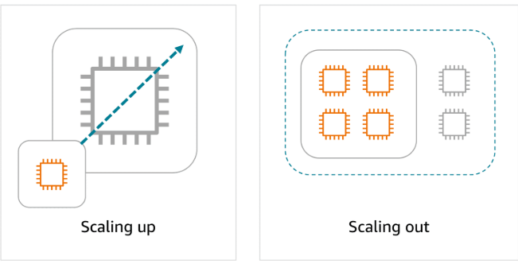

# Escalabilidad, Balanceo de Carga y Mensajería en AWS

AWS permite construir aplicaciones resilientes, escalables y desacopladas. Aquí se explica cómo funcionan los conceptos clave y servicios relacionados:

---

## 1. Escalabilidad y Elasticidad en Amazon EC2

Uno de los grandes beneficios de AWS es la capacidad de ajustar los recursos de cómputo según la demanda, logrando eficiencia y ahorro de costos. Esto se logra gracias a los conceptos de escalabilidad y elasticidad.

### ¿Qué es escalabilidad?

La escalabilidad es la capacidad de un sistema para crecer y manejar una mayor carga de trabajo añadiendo recursos. Hay dos formas principales:

- **Scaling up (vertical):** Aumentar la potencia de una instancia (más CPU, RAM, etc.).
- **Scaling out (horizontal):** Añadir más instancias para repartir la carga.
  

### ¿Qué es elasticidad?

La elasticidad es la capacidad de ajustar automáticamente los recursos en tiempo real, aumentando durante picos de demanda y reduciendo cuando baja la carga. Así, solo pagas por lo que realmente usas.

### ¿Cómo lo hace AWS?

Con Amazon EC2 Auto Scaling puedes definir grupos de instancias que se ajustan automáticamente según métricas como uso de CPU, latencia o tráfico. Esto asegura alta disponibilidad y eficiencia de costos.

#### Ejemplo de Auto Scaling

Supón que tienes una aplicación web. Puedes configurar un grupo de Auto Scaling con:

- **Capacidad mínima:** Número mínimo de instancias siempre activas.
- **Capacidad deseada:** Número ideal de instancias para la carga actual.
- **Capacidad máxima:** Límite superior para evitar costos excesivos.
  
  Cuando la demanda sube, Auto Scaling lanza más instancias; cuando baja, las elimina. Así, tu aplicación siempre tiene la capacidad adecuada y nunca pagas de más.

---

## 2. Dirigiendo el tráfico con Elastic Load Balancing (ELB)

Cuando tienes varias instancias EC2, necesitas distribuir el tráfico de manera eficiente para evitar que unas estén sobrecargadas y otras inactivas. Aquí entra en juego Elastic Load Balancing (ELB).

### ¿Qué es ELB?

ELB es un servicio que distribuye automáticamente el tráfico entrante entre múltiples recursos, como instancias EC2, para optimizar el rendimiento y la disponibilidad. ELB es el punto de entrada único para el tráfico web y se ajusta automáticamente a la demanda.

### Beneficios de ELB

- **Distribución eficiente:** Reparte el tráfico entre instancias, evitando sobrecargas y optimizando el uso de recursos.
- **Escalado automático:** Se ajusta al tráfico, añadiendo o quitando instancias según la demanda.
- **Gestión simplificada:** Desacopla los tiers de la arquitectura, reduce la sincronización manual y gestiona mantenimiento y failover automáticamente.

### Métodos de enrutamiento de ELB

ELB utiliza varios métodos para dirigir el tráfico:

- **Round Robin:** Distribuye el tráfico de forma cíclica entre todos los servidores disponibles.
  
- **Least Connections:** Envía tráfico al servidor con menos conexiones activas.
  
- **IP Hash:** Usa la IP del cliente para dirigirlo siempre al mismo servidor.
  
- **Least Response Time:** Dirige el tráfico al servidor con menor tiempo de respuesta, minimizando la latencia.
  

#### Ejemplo práctico: ELB en la industria de la salud

Imagina un hospital con un portal de citas en línea. Durante horas pico, el tráfico aumenta mucho. ELB distribuye las solicitudes entre los servidores disponibles, asegurando que ninguno se sobrecargue y que los pacientes siempre tengan acceso rápido y confiable, incluso en momentos de alta demanda.

---

## 3. Mensajería y Colas en AWS

En arquitecturas modernas, la comunicación eficiente y resiliente entre componentes es clave. Aquí entran los servicios de mensajería y colas de AWS: SQS, SNS y EventBridge.

### ¿Por qué usar colas y mensajería?

En sistemas acoplados (tightly coupled), si un componente falla, puede afectar a todo el sistema. Al introducir una cola (buffer), desacoplas los componentes (loose coupling): si un servicio falla, los mensajes quedan en la cola y se procesan cuando el servicio vuelve a estar disponible.

**Ejemplo cafetería:** El cajero toma pedidos y los pone en una pizarra (cola). El barista toma los pedidos de la pizarra cuando está listo. Así, ambos trabajan a su ritmo y el sistema es más resiliente.

### Amazon SQS (Simple Queue Service)

- Servicio de colas de mensajes.
- Permite enviar, almacenar y recibir mensajes entre componentes, sin perder mensajes y sin que ambos servicios estén disponibles al mismo tiempo.
- Escala automáticamente y es fácil de usar.
  **Ejemplo:** Un agente de soporte pone tickets en la cola; el especialista los resuelve cuando está disponible. Así, el flujo nunca se detiene.

### Amazon SNS (Simple Notification Service)

- Servicio de notificaciones tipo "publicar-suscribir".
- Permite enviar mensajes a múltiples suscriptores (emails, SMS, endpoints, Lambda, etc.).
- Ideal para notificaciones inmediatas y segmentadas.
  **Ejemplo:** Una empresa segmenta sus comunicaciones en temas (nuevos productos, ofertas, eventos). Los clientes se suscriben solo a los temas que les interesan y reciben notificaciones personalizadas.

### Amazon EventBridge

- Servicio serverless para arquitecturas orientadas a eventos.
- Permite conectar aplicaciones usando eventos, enrutar, filtrar y transformar mensajes entre servicios AWS, apps propias y de terceros.
- Ideal para flujos complejos y desacoplados.
  **Ejemplo:** En una app de delivery, EventBridge enruta eventos como "pedido realizado" a los servicios de pago, restaurante, inventario y reparto, asegurando que cada uno actúe de forma independiente y resiliente.

---

## Resumen didáctico

- **Escalabilidad:** Capacidad de crecer agregando recursos (vertical u horizontal).
- **Elasticidad:** Ajuste automático de recursos en tiempo real.
- **Auto Scaling:** Automatiza el escalado de instancias EC2 según la demanda.
- **ELB:** Distribuye el tráfico eficientemente, mejora la disponibilidad y simplifica la gestión de aplicaciones escalables en AWS.
- **Acoplamiento fuerte:** Componentes dependen unos de otros; si uno falla, afecta a los demás.
- **Acoplamiento débil:** Uso de colas/mensajería para desacoplar; mayor resiliencia y escalabilidad.
- **SQS:** Cola de mensajes para desacoplar procesos.
- **SNS:** Notificaciones a múltiples suscriptores.
- **EventBridge:** Integración y orquestación de eventos entre servicios.
