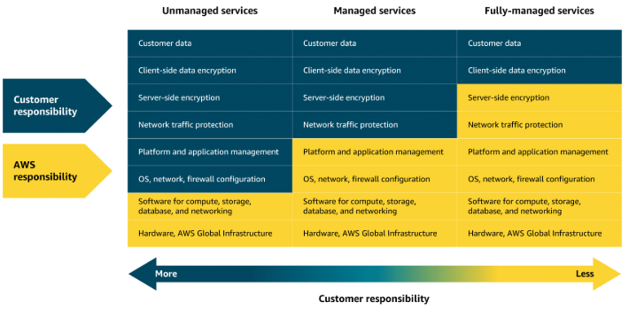

## Introducción a los servicios de cómputo en AWS

En AWS, existen diferentes niveles de servicios de cómputo que varían según el grado de control y responsabilidad que tienes como usuario:

- **Servicios no gestionados (unmanaged):** Como Amazon EC2, te dan control total sobre la configuración, administración y mantenimiento de las instancias virtuales. Eres responsable de instalar, actualizar y asegurar el sistema operativo, así como de gestionar la red y las aplicaciones. AWS solo se encarga de la infraestructura física subyacente.

- **Servicios gestionados (managed):** AWS asume más tareas operativas, como el escalado, la disponibilidad y parte del mantenimiento. Ejemplos incluyen Elastic Load Balancer (ELB), SNS y SQS. Tú configuras el servicio según tus necesidades y AWS se encarga de que funcione correctamente, reduciendo la carga de administración.

- **Servicios totalmente gestionados o serverless:** Llevan la abstracción al máximo. No gestionas servidores ni infraestructura; solo te concentras en tu código y lógica de negocio. AWS Lambda es un ejemplo: AWS administra la infraestructura, el escalado y la disponibilidad, mientras tú solo te ocupas de tu aplicación.

### ¿Cómo elegir?

La elección depende de tus necesidades: si requieres control total y personalización, opta por servicios no gestionados. Si prefieres enfocarte en el desarrollo y reducir tareas operativas, los servicios gestionados o serverless son ideales.

**Analogía:** Usar servicios no gestionados es como preparar café con una máquina profesional: tienes control total, pero requiere más trabajo. Los servicios gestionados son como una cafetera de cápsulas: menos personalización, pero más comodidad. Los servicios serverless son como pedir café listo para llevar: solo te preocupas por disfrutarlo.

### Responsabilidad compartida

Recuerda el modelo de responsabilidad compartida: AWS se encarga de la seguridad de la nube (infraestructura), y tú eres responsable de la seguridad en la nube (configuración, datos, aplicaciones).

En las siguientes lecciones, profundizarás en servicios como AWS Lambda, Amazon ECS, Amazon EKS y Elastic Beanstalk, para que puedas elegir la mejor opción según tu caso de uso.

---
