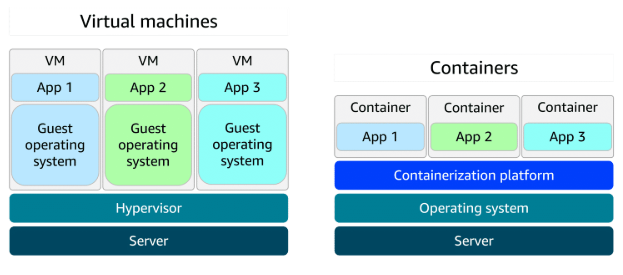
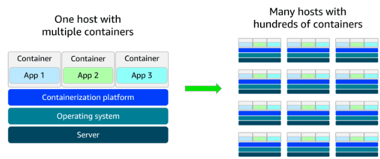

## AWS Lambda: Computación Serverless

AWS Lambda es un servicio de cómputo serverless que te permite ejecutar código en respuesta a eventos, sin necesidad de administrar servidores. Solo subes tu función, configuras un disparador (trigger) y Lambda se encarga de todo lo demás: aprovisionamiento, escalado, alta disponibilidad y mantenimiento de la infraestructura.

**¿Cómo funciona Lambda?**

1. **Sube tu código:** Cargas tu función a Lambda.
2. **Configura un trigger:** Elige el evento que activará tu función (por ejemplo, la subida de un archivo, una petición HTTP, o un mensaje en una cola).
3. **Ejecución automática:** Lambda ejecuta tu código solo cuando ocurre el evento, escalando automáticamente según la demanda.
4. **Pago por uso:** Solo pagas por el tiempo de cómputo consumido, medido en milisegundos.

**Ventajas:**

- No gestionas servidores ni infraestructura.
- Escalado automático y alta disponibilidad.
- Integración sencilla con otros servicios AWS.
- Soporte para varios lenguajes (Python, Node.js, Java, y más).

**Limitaciones:**

- Cada ejecución puede durar hasta 15 minutos.
- Ideal para procesos rápidos y event-driven.

**Ejemplo de uso:**
Procesamiento de imágenes en tiempo real: Cuando un usuario sube una foto, Lambda puede redimensionarla y guardarla automáticamente, sin preocuparte por la infraestructura.

---

## Contenedores y Orquestación en AWS

Los contenedores permiten empaquetar aplicaciones y sus dependencias en una unidad portátil y consistente, facilitando su despliegue en cualquier entorno. Son más ligeros y rápidos que las máquinas virtuales, ya que comparten el sistema operativo del host.

**Ventajas de los contenedores:**

- Portabilidad: "Funciona en mi máquina" ahora funciona en cualquier lado.
- Eficiencia: Arrancan rápido y consumen menos recursos que una VM.
- Consistencia: El entorno de ejecución es siempre el mismo.

### Orquestación de contenedores

Cuando tienes muchos contenedores, necesitas herramientas para gestionarlos, escalarlos y mantenerlos disponibles. Aquí entran los servicios de orquestación:

- **Amazon ECS (Elastic Container Service):** Orquestador propio de AWS, fácil de usar e integrado con otros servicios. Permite definir recursos y políticas, y AWS gestiona el ciclo de vida de los contenedores.
- **Amazon EKS (Elastic Kubernetes Service):** Servicio gestionado de Kubernetes, ideal para quienes buscan flexibilidad y compatibilidad con entornos híbridos o multi-nube.

### Almacenamiento de imágenes de contenedor

- **Amazon ECR (Elastic Container Registry):** Registro gestionado para almacenar, versionar y distribuir imágenes de contenedor de forma segura y eficiente.

### Opciones de cómputo para contenedores

- **EC2:** Control total sobre la infraestructura, pero requiere gestión manual.
- **AWS Fargate:** Opción serverless para contenedores. No gestionas servidores; solo defines los recursos y Fargate ejecuta los contenedores por ti. Compatible con ECS y EKS.

**Ejemplo de flujo de trabajo con contenedores en AWS:**

1. Empaquetas tu aplicación en una imagen de contenedor y la subes a ECR.
2. Eliges un orquestador (ECS o EKS) para desplegar y gestionar los contenedores.
3. Seleccionas el modo de ejecución: EC2 (más control) o Fargate (más simplicidad).

---

### Resumen visual

Las siguientes imágenes muestran la diferencia entre máquinas virtuales y contenedores, y cómo escalar contenedores en AWS:

---

Con AWS Lambda y los servicios de contenedores, puedes elegir la solución que mejor se adapte a tus necesidades: desde funciones event-driven sin servidores, hasta aplicaciones complejas y portables con contenedores y orquestación automatizada.

---

## Servicios de cómputo adicionales en AWS

Además de EC2, Lambda y los servicios de contenedores, AWS cuenta con soluciones especializadas para necesidades concretas, facilitando desde el despliegue de aplicaciones hasta la integración con entornos locales. A continuación, un resumen de los más relevantes:

### Elastic Beanstalk

Servicio totalmente gestionado que simplifica el despliegue, administración y escalado de aplicaciones web. Solo necesitas subir tu código y Elastic Beanstalk se encarga de aprovisionar la infraestructura, escalar, balancear la carga y monitorear la salud de la aplicación. Soporta múltiples lenguajes y frameworks (Java, .NET, Python, Node.js, Docker, entre otros). Permite conservar control sobre los recursos subyacentes, pero automatiza las tareas operativas.

**¿Para qué sirve?**

- Desplegar aplicaciones web, APIs REST, backends móviles y microservicios con escalado automático y gestión simplificada.

### AWS Batch

Servicio gestionado para ejecutar cargas de trabajo por lotes (batch) a gran escala. AWS Batch programa, administra y escala automáticamente los recursos de cómputo necesarios para procesar trabajos en paralelo, optimizando el uso de la infraestructura según la demanda.

**¿Para qué sirve?**

- Procesamiento de grandes volúmenes de datos, simulaciones científicas, análisis financiero, transcodificación de medios, procesamiento de big data, entrenamiento de modelos de machine learning y genómica.

### Amazon Lightsail

Solución sencilla y económica para lanzar servidores virtuales (VPS), almacenamiento, bases de datos y redes con precios predecibles. Es ideal para pequeñas empresas, desarrolladores o quienes buscan una experiencia AWS simplificada sin la complejidad de la consola completa.

**¿Para qué sirve?**

- Aplicaciones web básicas, sitios de bajo tráfico, entornos de desarrollo y prueba, sitios para pequeñas empresas, blogs y aprendizaje de servicios en la nube.

### AWS Outposts

Solución híbrida que extiende la infraestructura y servicios de AWS a centros de datos locales. Permite ejecutar servicios de AWS en tus instalaciones, manteniendo una experiencia consistente entre la nube y el entorno local. Es útil para necesidades de baja latencia, procesamiento local de datos, modernización de aplicaciones heredadas o cumplimiento de normativas.

**¿Para qué sirve?**

- Aplicaciones que requieren baja latencia, procesamiento en ubicaciones remotas, migración de sistemas legados y cumplimiento de requisitos regulatorios o de residencia de datos.

---

Con estos servicios adicionales, AWS cubre una amplia gama de necesidades: desde el despliegue rápido de aplicaciones hasta la integración con infraestructuras locales, permitiéndote elegir la solución más adecuada para cada caso de uso.
