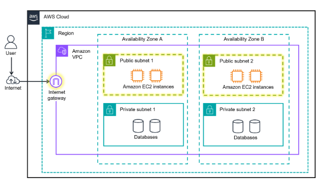

## Introducción a redes en AWS

En AWS, la red es el conjunto de servicios e infraestructura que conecta y protege tus aplicaciones y datos. Aquí aprenderás los conceptos básicos de redes en la nube, centrándote en VPC y subredes.

### ¿Qué aprenderás?

- Qué es una VPC y para qué sirve.
- Qué es una subred y cómo se usa.
- Diferencia entre subred pública y privada.

### ¿Qué es una VPC?

Amazon Virtual Private Cloud (VPC) te permite crear una red virtual aislada dentro de AWS, donde puedes lanzar y organizar tus recursos de forma segura. Es como tener tu propia red privada en la nube, con control total sobre direcciones IP, subredes, reglas de acceso y más.

### Subredes: públicas y privadas

Las subredes dividen tu VPC en segmentos más pequeños. Puedes crear:

- **Subredes públicas:** Recursos accesibles desde internet (por ejemplo, servidores web). Se conectan a un internet gateway.
- **Subredes privadas:** Recursos internos sin acceso directo a internet (por ejemplo, bases de datos). Ideales para proteger información sensible.

**Ejemplo:**
En una cafetería, los cajeros (en una subred pública) atienden a los clientes, mientras que los baristas (en una subred privada) preparan las bebidas sin interactuar directamente con el público.

### Diagramas de red en AWS

Los diagramas de red muestran cómo se conectan los componentes en la nube. Son útiles para visualizar redundancia, seguridad y escalabilidad, y sirven como planos para construir soluciones robustas.

---
