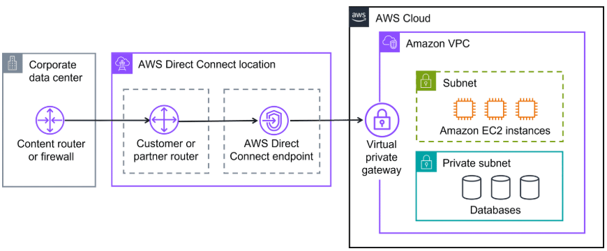
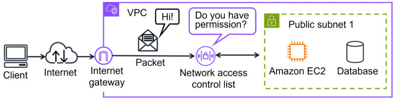
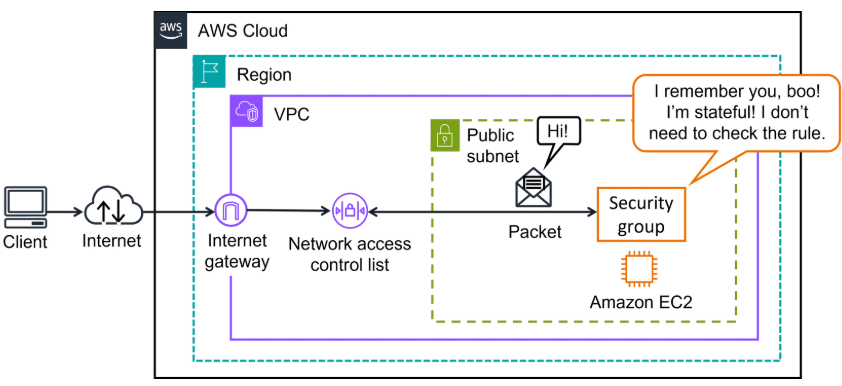
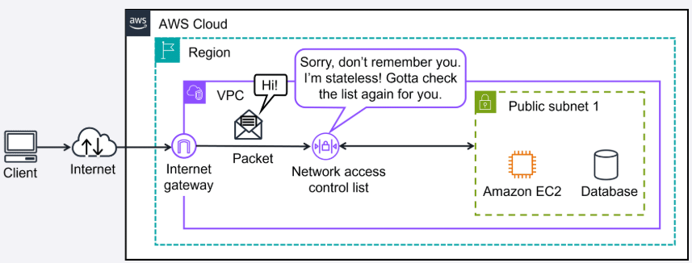
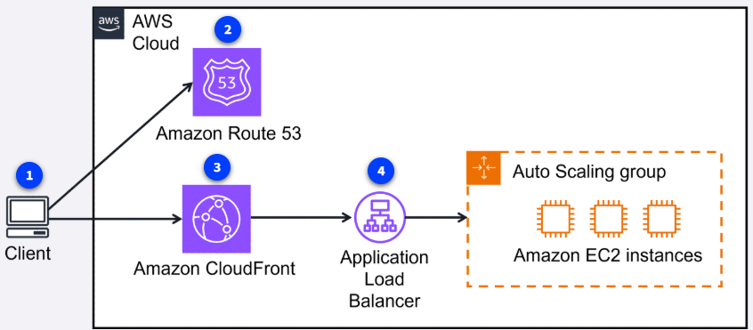

## Componentes clave de red en AWS

En esta sección aprenderás sobre los principales componentes de red en AWS, cómo organizar recursos y las distintas formas de conectar tu infraestructura a la nube.

### VPC y subredes

En esta sección aprenderás los conceptos fundamentales de redes en AWS, cómo organizar recursos y las distintas formas de conectar tu infraestructura a la nube de forma segura y eficiente.
Una VPC (Virtual Private Cloud) es tu red privada en AWS. Dentro de la VPC, puedes crear subredes para agrupar y aislar recursos según su función o nivel de acceso (público o privado).
Una VPC (Virtual Private Cloud) es tu red privada y aislada dentro de AWS. Dentro de la VPC, puedes crear subredes para agrupar y aislar recursos según su función o nivel de acceso (público o privado), facilitando la organización y seguridad de tus aplicaciones.

### Gateways: conectando tu VPC

**Internet Gateway:** Permite que recursos en subredes públicas tengan acceso a internet. Es la puerta de entrada y salida pública de tu red.
**Virtual Private Gateway:** Permite conexiones privadas y seguras (VPN) entre tu VPC y una red externa, como tu centro de datos. Es ideal para recursos internos que no deben ser accesibles desde internet.

- **Virtual Private Gateway:** Permite conexiones privadas y seguras (VPN) entre tu VPC y una red externa, como tu centro de datos. Es ideal para recursos internos que no deben ser accesibles desde internet.
  AWS ofrece varias formas de conectar tu red local, sucursales o usuarios remotos con la nube:
- **AWS Client VPN:** VPN gestionada para acceso remoto seguro de empleados o sucursales.
- **AWS Site-to-Site VPN:** VPN cifrada entre tu centro de datos y tu VPC, ideal para migraciones o comunicación segura entre ubicaciones.
- **AWS PrivateLink:** Conecta tu VPC a servicios y recursos de AWS (o de otros proveedores) de forma privada, sin exponer tráfico a internet.
- **AWS Direct Connect:** Conexión física dedicada y privada entre tu red y AWS, ideal para grandes volúmenes de datos, baja latencia y cumplimiento regulatorio.
- **AWS Client VPN:** VPN gestionada para conectar trabajadores remotos o redes locales a AWS de forma segura y escalable.
  **¿Cuándo usar cada opción?**
- **Client VPN:** Acceso remoto seguro para empleados.
- **Site-to-Site VPN:** Conexión segura entre oficinas, sucursales y la nube.
- **PrivateLink:** Acceso privado a servicios sin salir de la red de AWS.
- **Direct Connect:** Transferencias de datos a gran escala, baja latencia y alta confiabilidad.
  **¿Cuándo usar cada opción?**

### Otros gateways importantes

- **Transit Gateway:** Centraliza la conectividad entre múltiples VPCs y redes on-premises.
- **NAT Gateway:** Permite que instancias en subredes privadas accedan a internet para actualizaciones, sin ser accesibles desde fuera.
- **API Gateway:** Servicio para crear, publicar y gestionar APIs de forma segura y escalable.
- **PrivateLink:** Acceso privado a servicios sin salir de la red de AWS.
  Con estos componentes y servicios, puedes diseñar redes seguras, escalables y flexibles en AWS, conectando recursos internos, externos y remotos según las necesidades de tu organización.
- **Direct Connect:** Transferencias de datos a gran escala, baja latencia y alta confiabilidad.
  Además de los componentes de red y conectividad, la seguridad interna de tu VPC es fundamental. AWS ofrece dos mecanismos principales para controlar el tráfico: los security groups y las network ACLs.
  

### ¿Cómo funciona el tráfico en una VPC?

Cuando un paquete de datos entra o sale de una VPC, pasa por varios controles de seguridad:

1. **Network ACL (NACL):** Controla el tráfico a nivel de subred, revisando cada paquete que cruza el límite de la subred (entrada y salida). Es como el control de pasaportes en un aeropuerto.
2. **Security Group:** Controla el tráfico a nivel de instancia (por ejemplo, EC2). Es como el portero de un edificio, que solo deja pasar a quienes están en la lista.

- **Transit Gateway:** Centraliza la conectividad entre múltiples VPCs y redes on-premises.

### Network ACLs (NACL)

- Funcionan a nivel de subred.
- Son **stateless**: no recuerdan el estado de las conexiones, revisan cada paquete de forma independiente.
- Permiten reglas de **permitir** y **denegar** tráfico.
- Se usan para control amplio de tráfico entre subredes.

### Security Groups

- Funcionan a nivel de instancia (EC2, etc.).
- Son **stateful**: recuerdan el estado de las conexiones, por lo que el tráfico de respuesta se permite automáticamente.
- Solo permiten reglas de **permitir** tráfico.
- Se usan para control fino de acceso a recursos individuales.
  Además de los componentes de red y conectividad, la seguridad interna de tu VPC es fundamental. AWS ofrece dos mecanismos principales para controlar el tráfico: los security groups y las network ACLs.

### Diferencias clave

| Característica     | Security Group (SG)          | Network ACL (NACL)        |
| ------------------ | ---------------------------- | ------------------------- |
| Alcance            | Instancia (EC2)              | Subred                    |
| Estado             | Stateful (con estado)        | Stateless (sin estado)    |
| Tipos de reglas    | Solo permitir                | Permitir y denegar        |
| Tráfico de retorno | Permitido automáticamente    | Debe permitirse explícito |
| Uso                | Control granular por recurso | Control amplio por subred |

### Ejemplo visual del flujo de paquetes

- Son **stateless**: no recuerdan el estado de las conexiones, revisan cada paquete de forma independiente.

### Responsabilidad compartida

Según el modelo de responsabilidad compartida de AWS, tú eres responsable de definir y mantener las reglas de seguridad en tus subredes y recursos usando security groups y network ACLs. Estas herramientas son esenciales para proteger tus aplicaciones y datos en la nube.

- Se usan para control amplio de tráfico entre subredes.

## Demostración: Creando una Amazon VPC paso a paso

Veamos cómo llevar a la práctica la creación de una VPC y sus componentes principales usando la AWS Management Console.

### Security Groups

**Pasos principales:**

1. Crear la VPC y definir el rango de direcciones IP (CIDR block).
2. Crear subredes públicas y privadas en al menos dos zonas de disponibilidad (AZs) para alta disponibilidad.
3. Crear y adjuntar un internet gateway a la VPC.
4. Crear una tabla de ruteo, agregar rutas y asociar las subredes públicas.
5. Configurar reglas de seguridad con security groups y network ACLs.
   Este flujo garantiza que los recursos públicos (como servidores web) tengan acceso a internet, mientras que los recursos privados (como bases de datos) permanezcan aislados y seguros.

## Global Networking y Edge Services

AWS ofrece servicios de red global para mejorar la disponibilidad, velocidad y seguridad de tus aplicaciones a nivel mundial. Los principales servicios son:

- **Amazon Route 53:** Servicio DNS que traduce nombres de dominio a direcciones IP y permite enrutar tráfico según políticas como geolocalización o latencia.
- **Amazon CloudFront:** Red de entrega de contenido (CDN) que distribuye contenido estático y dinámico desde ubicaciones cercanas al usuario, acelerando la carga y reduciendo la latencia.
- **AWS Global Accelerator:** Optimiza el enrutamiento global usando la red privada de AWS, mejorando la disponibilidad y el rendimiento de aplicaciones críticas.
  | Alcance | Instancia (EC2) | Subred |

### Ejemplo visual de flujo global

**¿Cómo funciona?**

1. El cliente solicita acceso a una aplicación o sitio web.
2. Route 53 resuelve el nombre de dominio y dirige la petición.
3. CloudFront entrega el contenido desde el edge location más cercano.
4. Un Application Load Balancer distribuye la carga entre instancias EC2.

Estos servicios permiten que tus aplicaciones sean rápidas, seguras y estén disponibles para usuarios en cualquier parte del mundo.

### Responsabilidad compartida

Según el modelo de responsabilidad compartida de AWS, tú eres responsable de definir y mantener las reglas de seguridad en tus subredes y recursos usando security groups y network ACLs. Estas herramientas son esenciales para proteger tus aplicaciones y datos en la nube.

---

## Demostración: Creando una Amazon VPC paso a paso

En esta sección verás cómo crear una VPC, subredes públicas y privadas, un internet gateway y tablas de ruteo usando la AWS Management Console.

**Pasos principales:**

1. Crear la VPC y definir el rango de direcciones IP (CIDR block).
2. Crear subredes públicas y privadas en al menos dos zonas de disponibilidad (AZs) para alta disponibilidad.
3. Crear y adjuntar un internet gateway a la VPC.
4. Crear una tabla de ruteo, agregar rutas y asociar las subredes públicas.
5. Configurar reglas de seguridad con security groups y network ACLs.

Este flujo garantiza que los recursos públicos (como servidores web) tengan acceso a internet, mientras que los recursos privados (como bases de datos) permanezcan aislados y seguros.

---

## Global Networking y Edge Services

AWS ofrece servicios de red global para mejorar la disponibilidad, velocidad y seguridad de tus aplicaciones a nivel mundial. Los principales servicios son:

- **Amazon Route 53:** Servicio DNS que traduce nombres de dominio a direcciones IP y permite enrutar tráfico según políticas como geolocalización o latencia.
- **Amazon CloudFront:** Red de entrega de contenido (CDN) que distribuye contenido estático y dinámico desde ubicaciones cercanas al usuario, acelerando la carga y reduciendo la latencia.
- **AWS Global Accelerator:** Optimiza el enrutamiento global usando la red privada de AWS, mejorando la disponibilidad y el rendimiento de aplicaciones críticas.

### Ejemplo visual de flujo global

**¿Cómo funciona?**

1. El cliente solicita acceso a una aplicación o sitio web.
2. Route 53 resuelve el nombre de dominio y dirige la petición.
3. CloudFront entrega el contenido desde el edge location más cercano.
4. Un Application Load Balancer distribuye la carga entre instancias EC2.

Estos servicios permiten que tus aplicaciones sean rápidas, seguras y estén disponibles para usuarios en cualquier parte del mundo.

---
