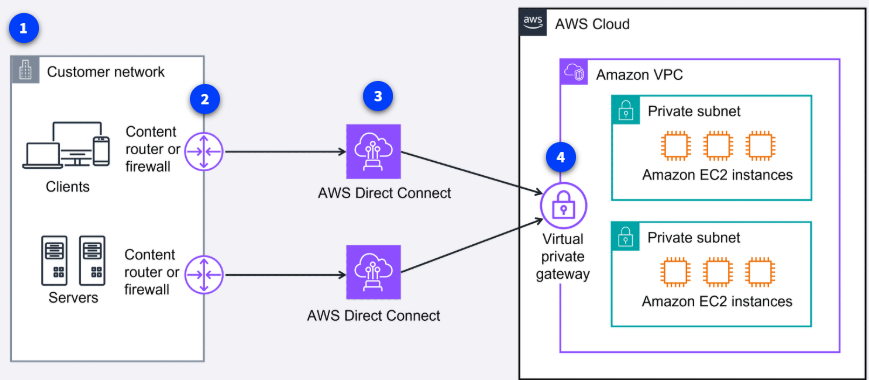
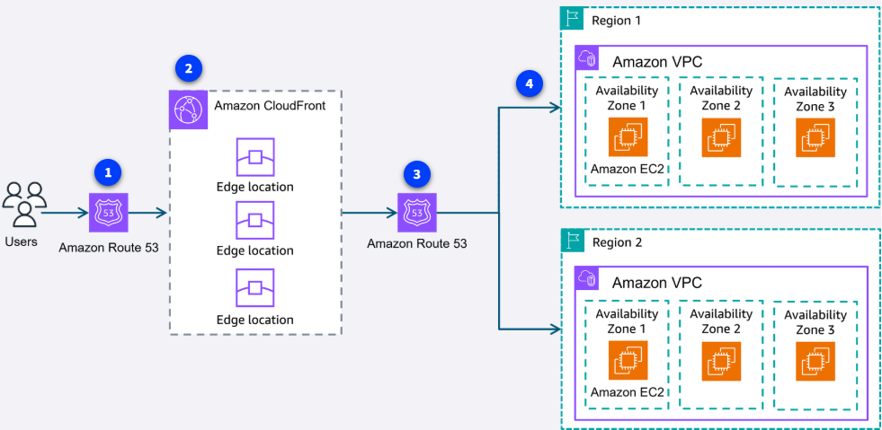

## Arquitecturas globales en AWS

En esta sección aprenderás cómo se combinan VPN, Direct Connect, CloudFront y Route 53 para construir arquitecturas globales seguras, rápidas y tolerantes a fallos.

### ¿Cuándo usar VPN o Direct Connect?

- **VPN:** Útil para conexiones seguras y flexibles, acceso remoto o transferencias de datos pequeñas/medianas. Es ideal para empleados remotos o cuando no se requiere una conexión dedicada.
- **Direct Connect:** Recomendado para grandes volúmenes de datos, baja latencia, cumplimiento regulatorio o cuando se necesita una conexión dedicada y de alto rendimiento entre tu red local y AWS.
- **Combinación:** Muchas empresas usan ambas: Direct Connect para el tráfico principal y VPN como respaldo (failover) en caso de falla de la línea dedicada.

### Ejemplo: Alta disponibilidad y ancho de banda con Direct Connect

1. La red del cliente (usuarios y servidores) requiere conexiones seguras y de alto ancho de banda para transferencias grandes y aplicaciones críticas.
2. El tráfico pasa por routers/firewalls hacia Direct Connect.
3. Se pueden combinar varias conexiones Direct Connect para mayor tolerancia a fallos y ancho de banda agregado.
4. Un virtual private gateway conecta de forma segura a los recursos privados en la VPC de AWS.

### Ejemplo: Entrega de contenido global con CloudFront y Route 53

1. Los usuarios acceden al sitio web usando un dominio personalizado; la petición va primero a Route 53.
2. Route 53 usa políticas de enrutamiento para dirigir al usuario a la edge location de CloudFront más cercana.
3. CloudFront entrega el contenido desde el edge location óptimo.
4. El contenido se obtiene del servidor de origen en la Región adecuada, usando múltiples zonas de disponibilidad para alta disponibilidad.

---

Estas arquitecturas permiten a las empresas ofrecer experiencias rápidas, seguras y resilientes a usuarios en todo el mundo, combinando lo mejor de la nube y la conectividad híbrida.
