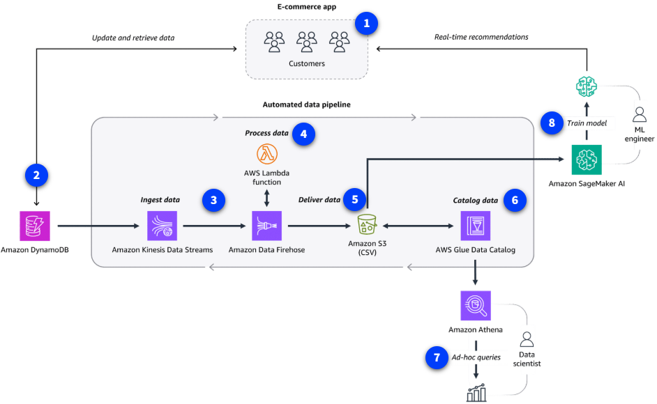

# Analítica de Datos y AI/ML en la Vida Real

A continuación, se muestra cómo una empresa de e-commerce puede automatizar la ingesta, procesamiento y entrega de datos para análisis y entrenamiento de modelos de machine learning, usando servicios de AWS. El objetivo es que tanto científicos de datos como ingenieros de ML puedan usar el mismo conjunto de datos de manera eficiente y automatizada.

---

## Flujo de la solución (referencia a los números del diagrama)

1. **Recomendaciones en tiempo real:**

   - La app de e-commerce utiliza un modelo de ML para recomendar productos a los clientes.

2. **Almacenamiento de datos:**

   - Amazon DynamoDB almacena los datos históricos de clientes y transacciones, ideal para lecturas y escrituras de baja latencia.

3. **Ingesta de datos:**

   - Amazon Kinesis Data Streams recibe los cambios de datos desde DynamoDB.
   - Amazon Data Firehose agrega y transporta los datos para su procesamiento.

4. **Procesamiento de datos:**

   - Firehose invoca una función AWS Lambda para transformar los datos de JSON a formato .csv, adecuado para análisis y ML.

5. **Entrega de datos:**

   - Firehose entrega los datos procesados al data lake de la empresa en Amazon S3, haciéndolos accesibles para múltiples consumidores.

6. **Catalogación de datos:**

   - AWS Glue Data Catalog crea un repositorio de metadatos, definiendo el esquema y la ubicación de los datos en S3.

7. **Análisis de datos:**

   - Los científicos de datos usan Amazon Athena para consultar y analizar los datos directamente en S3 usando SQL estándar.

8. **Entrenamiento de modelos:**
   - Amazon SageMaker AI accede al mismo dataset en S3 para entrenar y actualizar modelos de recomendación.

---

## Resumen de beneficios

- **Automatización:** El pipeline reduce errores y ahorra tiempo al eliminar tareas manuales.
- **Reutilización de datos:** El mismo dataset sirve para análisis y entrenamiento de modelos.
- **Escalabilidad:** Todos los servicios son gestionados y escalan según la demanda.
- **Eficiencia:** Los datos se transforman y entregan en el formato adecuado para cada consumidor.

> **Consejo:** Automatizar pipelines de datos permite a los equipos enfocarse en el análisis y la innovación, en lugar de en tareas repetitivas de integración y transformación.

Esta arquitectura es solo un ejemplo básico; AWS permite construir pipelines mucho más complejos y personalizados según las necesidades del negocio.
