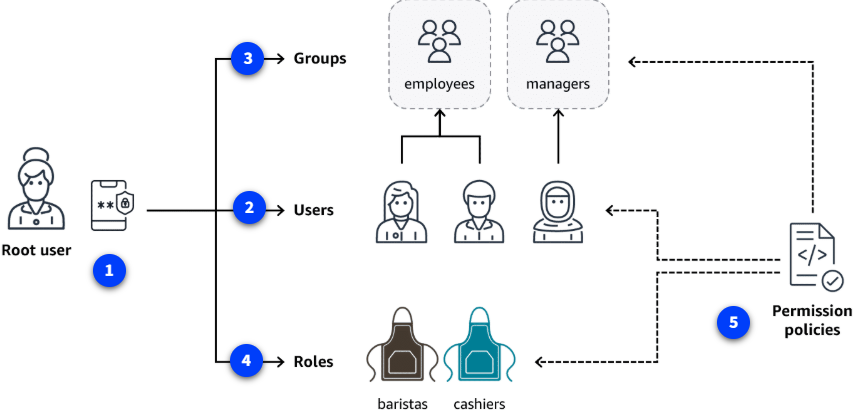

# Controles de Seguridad en AWS

AWS proporciona una variedad de servicios y mecanismos para prevenir accesos no autorizados, proteger redes y aplicaciones, cifrar datos y detectar incidentes de seguridad. Aquí tienes un resumen práctico de los controles clave y mejores prácticas.

---

## 1. Gestión de identidades y accesos (IAM)

- **Root user:** Usuario principal con control total. Usa contraseña fuerte y activa MFA. No lo uses para tareas diarias.
- **IAM users:** Identidades individuales con permisos mínimos necesarios.
- **IAM groups:** Agrupa usuarios y asigna permisos de forma centralizada.
- **IAM roles:** Permiten acceso temporal a recursos, ideales para servicios, aplicaciones y federación de identidades.
- **IAM policies:** Documentos JSON que definen permisos (allow/deny) sobre recursos y acciones.
- **Principio de mínimo privilegio:** Da solo los permisos estrictamente necesarios.
- **IAM Identity Center:** Centraliza la gestión de identidades y acceso (SSO, federación).
- **Secrets Manager:** Gestiona y rota credenciales y secretos de forma segura.
- **Systems Manager:** Automatiza administración, parches y gestión de nodos.

---

## 2. Protección de redes y aplicaciones

- **Security Groups:** Filtran tráfico a nivel de red, solo permiten solicitudes válidas.
- **Elastic Load Balancer (ELB):** Distribuye tráfico y ayuda a mitigar ataques.
- **AWS Shield:** Protección automática contra DDoS (Standard) y avanzada (Advanced).
- **AWS WAF:** Firewall de aplicaciones web, filtra tráfico malicioso y bloquea IPs.
- **Regiones y AZs:** La escala global de AWS dificulta ataques de denegación de servicio.

---

## 3. Cifrado y protección de datos

- **Cifrado en reposo:**
  - S3: Cifrado por defecto en nuevos buckets y objetos.
  - EBS: Volúmenes y snapshots cifrados.
  - DynamoDB: Cifrado con claves gestionadas por KMS.
- **Cifrado en tránsito:**
  - SSL/TLS y AWS Certificate Manager (ACM) para proteger datos en movimiento.
- **AWS KMS:** Gestión centralizada de claves criptográficas.
- **Amazon Macie:** Descubre y protege datos sensibles en S3 usando ML.

---

## 4. Detección y respuesta a incidentes

- **Amazon Inspector:** Evalúa vulnerabilidades y desviaciones de buenas prácticas.
- **Amazon GuardDuty:** Detección inteligente de amenazas en cuentas y redes.
- **Amazon Detective:** Investiga causas raíz de incidentes con visualizaciones interactivas.
- **AWS Security Hub:** Consolida hallazgos de seguridad y cumplimiento en un solo panel.

---

## 5. Recursos adicionales y mejores prácticas

- **Documentación oficial:** Consulta la documentación de AWS Security, Identity & Compliance y el AWS Security Blog.
- **AWS Marketplace:** Encuentra herramientas de terceros para detección de amenazas, IAM, cifrado y cumplimiento.

> **Consejo:** Aplica el principio de mínimo privilegio, automatiza la gestión de accesos y parches, y usa servicios gestionados para fortalecer la seguridad de tu entorno AWS.

En las siguientes secciones, profundizarás en la configuración y uso de estos controles para proteger tus recursos en la nube.
