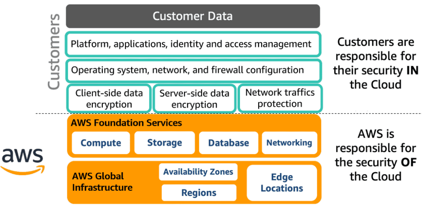

# Introducción a la Seguridad en AWS

La seguridad es una prioridad fundamental en AWS. La plataforma ofrece una amplia gama de servicios y herramientas que permiten a las organizaciones tener control, visibilidad y capacidad de auditoría sobre sus recursos y cargas de trabajo en la nube. Además, AWS facilita la agilidad y la automatización, aspectos clave para una respuesta efectiva ante incidentes de seguridad.

Entre los servicios más relevantes para la gestión de la seguridad destacan:

- **AWS Config:** Permite rastrear y auditar los recursos, proporcionando visibilidad sobre el inventario y la actividad de usuarios y aplicaciones.
- **AWS CloudTrail:** Registra todas las acciones realizadas en la cuenta, permitiendo responder preguntas como: ¿Qué acciones realizó un usuario específico en un periodo de tiempo? ¿Qué recurso fue afectado y desde qué dirección IP?

Estos servicios, junto con otros que se verán más adelante, forman la base para implementar buenas prácticas de seguridad y cumplimiento en la nube.

---

## Objetivos de aprendizaje

Al finalizar este apartado, podrás:

- Identificar los beneficios y responsabilidades de seguridad al usar AWS Cloud.
- Describir las características de control y gestión de acceso en AWS.
- Reconocer los servicios de protección de datos para asegurar información sensible.
- Explicar cómo se puede asegurar el acceso a la red de tus recursos en AWS.
- Determinar los servicios de AWS utilizados para registro y monitoreo de seguridad.

> **Recomendación:** Para un mejor entendimiento, es útil haber cursado previamente "AWS Cloud Practitioner Essentials".

---

## Principios de diseño para la seguridad en la nube

Existen principios clave que ayudan a fortalecer la seguridad y el cumplimiento en la nube. Estos principios guían la toma de decisiones y la arquitectura de soluciones seguras:

1. **Implementar una base sólida de identidad:** Aplica el principio de privilegio mínimo y la separación de funciones con autorizaciones adecuadas para cada interacción con tus recursos.
2. **Habilitar la trazabilidad:** Monitorea, alerta y audita acciones y cambios en tiempo real. Integra logs y métricas con sistemas que respondan automáticamente.
3. **Aplicar seguridad en todas las capas:** No te limites a una sola capa; utiliza un enfoque de defensa en profundidad con múltiples controles.
4. **Automatizar las mejores prácticas de seguridad:** Los mecanismos automatizados mejoran la capacidad de escalar de forma segura y eficiente. Implementa controles como código y gestiona plantillas versionadas.
5. **Proteger los datos en tránsito y en reposo:** Clasifica los datos según su sensibilidad y utiliza cifrado y controles de acceso donde sea necesario.
6. **Aplicar el principio de privilegio mínimo:** Otorga acceso solo a quienes realmente lo necesitan. Comienza negando todo acceso y concédelo según sea necesario.
7. **Prepararse para eventos de seguridad:** Ten un proceso de gestión de incidentes alineado a tu organización. Realiza simulacros y usa herramientas automatizadas para detección, investigación y recuperación.

Cada uno de estos principios será explorado en detalle en secciones posteriores.

---

## Modelo de responsabilidad compartida de AWS

AWS y sus clientes comparten la responsabilidad de la seguridad en la nube:

- **AWS es responsable de la seguridad de la nube:** Protege la infraestructura global que ejecuta todos los servicios (hardware, software, redes y centros de datos).
- **El cliente es responsable de la seguridad en la nube:** Debe proteger sus datos, sistemas operativos, redes, plataformas y recursos que implementa en AWS, así como cumplir con los requisitos de confidencialidad, integridad y disponibilidad de la información.

> _La imagen ilustra la separación de responsabilidades entre AWS y el cliente._

---

Esta introducción sienta las bases para comprender cómo abordar la seguridad en AWS, los servicios clave y los principios fundamentales para proteger tus recursos en la nube.
