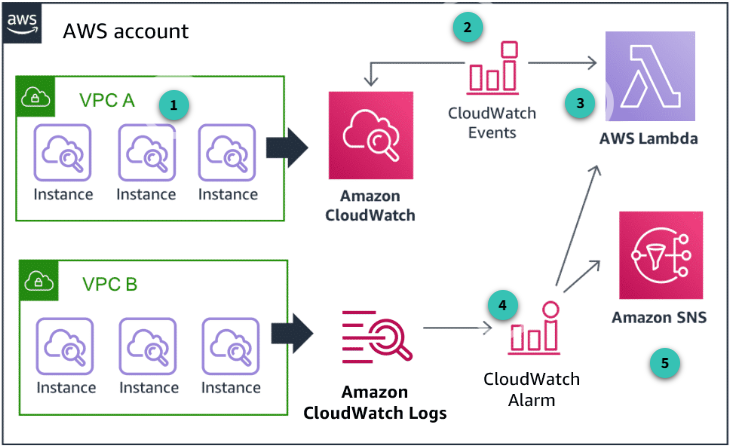

# Seguridad en la Nube en AWS

La seguridad en la nube es un pilar fundamental para cualquier organización que utilice servicios en la nube pública. AWS ofrece un modelo de responsabilidad compartida, donde AWS se encarga de la seguridad de la nube (infraestructura física, red, hardware, etc.) y el cliente es responsable de la seguridad en la nube (configuración, acceso, datos, aplicaciones). Este documento cubre los principales mecanismos, servicios y buenas prácticas para proteger identidades, datos, infraestructura y aplicaciones en AWS, así como la detección, respuesta y mitigación de amenazas.

---

## 1. Identidad y Acceso en AWS

Toda interacción con AWS (consola, CLI, SDKs, servicios) implica llamadas API autenticadas y autorizadas por IAM. Esto asegura que solo identidades válidas y con permisos adecuados puedan operar sobre los recursos. Por ejemplo, al crear un bucket S3 desde la consola, se realiza una llamada API autenticada y autorizada por IAM antes de ejecutarse. Así, AWS centraliza la gestión de seguridad y acceso.

### 1.1 AWS Identity and Access Management (IAM)

IAM es el servicio central para la gestión de identidades y permisos en AWS. Permite crear usuarios, grupos y roles, y asignarles permisos detallados sobre los recursos de la cuenta. La gestión cuidadosa de credenciales y permisos es la base de la seguridad en la nube. IAM actúa como el centro de control de "quién puede hacer qué" en tu cuenta AWS.

- **Usuarios y grupos IAM:** Un usuario representa una identidad individual con credenciales propias. Los grupos permiten organizar usuarios y asignar permisos de forma colectiva, facilitando la administración basada en roles (RBAC).
  > Ejemplo: Un grupo "Desarrolladores" puede tener permisos específicos para desarrollo, mientras que "Revisores" solo pueden auditar recursos.
  > 

#### Buenas prácticas IAM

- Aplica el principio de privilegio mínimo.
- Usa roles en vez de usuarios individuales para aplicaciones y servicios.
- Habilita MFA para todas las cuentas.
- Revisa y rota credenciales periódicamente.

### 1.2 Tipos de credenciales en AWS

AWS soporta varios tipos de credenciales para autenticación y acceso:

- **Usuario y contraseña:** Para acceso a la consola web. Se recomienda definir políticas de contraseñas robustas y rotación periódica.
- **Autenticación multifactor (MFA):** Añade una capa extra de seguridad, exigiendo un segundo factor para acceder.
- **Access Keys:** Claves de acceso para autenticación programática (CLI, SDKs). Deben protegerse y rotarse regularmente.
- **Pares de claves EC2:** Para acceso SSH seguro a instancias EC2.

Separar correctamente autenticación (verificar identidad) y autorización (definir permisos) es esencial para minimizar riesgos y limitar el alcance de acciones accidentales o maliciosas.

### 1.3 Servicios adicionales para gestión de identidad y acceso

Además de IAM, AWS ofrece servicios complementarios para proteger credenciales, federar usuarios y gestionar múltiples cuentas:

- **AWS Secrets Manager:** Gestión centralizada de secretos como contraseñas, claves API y credenciales de bases de datos. Facilita la rotación automática y el acceso programático seguro.
- **AWS IAM Identity Center:** Servicio de inicio de sesión único (SSO) para gestionar el acceso centralizado a múltiples cuentas y aplicaciones. Integra SAML y Active Directory.
- **AWS Security Token Service (STS):** Proporciona credenciales temporales y de privilegio limitado para usuarios o servicios que requieren acceso puntual o federado.
- **AWS Directory Service:** Permite usar Microsoft Active Directory gestionado en AWS para autenticación y autorización de recursos y cargas de trabajo.
- **AWS Organizations:** Facilita la gestión centralizada de políticas y cuentas AWS, agrupando cuentas en unidades organizativas y aplicando políticas de control de servicios (SCPs).

### 1.4 AWS Service Spotlight: Amazon Cognito

**Amazon Cognito** permite añadir registro, inicio de sesión y control de acceso a aplicaciones web y móviles. Soporta autenticación con proveedores externos (Google, Facebook, SAML) y gestiona la federación de identidades. Cognito maneja la emisión y validación de tokens, y permite mapear usuarios a roles con permisos diferenciados.

Flujo típico:

1. El usuario se autentica y obtiene tokens.
2. Los tokens se intercambian por credenciales temporales de AWS.
3. La aplicación accede a servicios AWS usando esas credenciales, sin exponer claves de largo plazo.

---

## 2. Controles Detectivos, Monitoreo y Auditoría

Los controles detectivos son esenciales para identificar amenazas o incidentes de seguridad. AWS ofrece servicios para capturar, recolectar y analizar logs, así como para monitorear cambios y actividades en los recursos y responder ante eventos.

### 2.1 AWS CloudTrail

AWS CloudTrail registra todas las llamadas a la API realizadas en tu cuenta, ya sea desde la consola, CLI, SDKs o entre servicios. Esto permite rastrear cambios, solucionar problemas operativos y cumplir con normativas internas y externas.

**Buenas prácticas:**

- Guarda los logs de CloudTrail en una cuenta separada y con acceso restringido para garantizar su integridad y facilitar auditorías forenses.
- Habilita la retención de logs y la integración con servicios de análisis.

### 2.2 Monitoreo y notificaciones: Amazon CloudWatch

Amazon CloudWatch permite monitorear recursos, recolectar logs, crear alarmas y automatizar respuestas ante eventos. Puedes integrar CloudWatch con SNS para notificaciones y con Lambda para remediación automática. Así, es posible detectar cambios no deseados y activar flujos de trabajo de respuesta.

Ejemplo: Configura una alarma para detectar un uso inusual de CPU en una instancia EC2 y notificar al equipo de operaciones.

### 2.3 Auditoría en AWS

La consola de AWS y la CLI permiten a los auditores revisar configuraciones y actividades para cumplir con estándares regulatorios. Los servicios clave para auditoría incluyen:

- Amazon S3 (access logs)
- Elastic Load Balancing (ELB access logs)
- Amazon CloudWatch y CloudWatch Logs
- AWS CloudTrail
- Amazon VPC (VPC Flow Logs)

**Ejemplos de logs auditables:**

- S3: Detalles de solicitudes, recursos y fechas
- ELB: IP del cliente, latencias, respuestas del servidor
- CloudWatch Logs: Monitoreo de sistemas y aplicaciones, búsqueda de patrones
- VPC Flow Logs: Información sobre tráfico de red, conectividad y seguridad

### 2.4 Servicios adicionales para controles detectivos

- **Amazon GuardDuty:** Detección inteligente de amenazas mediante machine learning y feeds de inteligencia. Identifica actividades sospechosas, ataques y compromisos de cuentas.
- **AWS Trusted Advisor:** Recomienda buenas prácticas, optimización de costos, rendimiento y seguridad. Notifica cambios y brechas detectadas.
- **Amazon VPC Flow Logs:** Captura información sobre el tráfico de red para análisis de conectividad y seguridad.
- **AWS Security Hub:** Consolida y prioriza alertas de seguridad de múltiples servicios y partners en un solo panel.

### 2.5 AWS Config

**AWS Config** es un servicio de monitoreo y evaluación continua de configuraciones. Permite ver el historial y estado actual de los recursos, detectar desviaciones de políticas y ejecutar reglas de cumplimiento (predefinidas o personalizadas). Es fundamental para auditoría, análisis forense y troubleshooting.

---

## 3. Protección de la Infraestructura y Aplicaciones

La protección de la infraestructura busca asegurar que los sistemas y recursos estén aislados y protegidos contra accesos no autorizados y vulnerabilidades, aplicando defensa en profundidad y automatización.

### 3.1 Protección mediante aislamiento: Amazon VPC

Con Amazon VPC puedes aislar recursos en la nube, lanzándolos en una red virtual definida por ti. Esto permite crear una topología similar a la de un centro de datos tradicional, pero con la flexibilidad de la nube. Los principales mecanismos de defensa en profundidad en VPC incluyen:

- **Subnet routing:** Agrupa instancias y recursos según necesidades de seguridad y operación, y define rutas de acceso.
- **Network ACLs:** Listas de control de acceso a nivel de subred, que actúan como firewall para controlar tráfico entrante y saliente mediante reglas de ALLOW y DENY.
- **Security Groups:** Firewalls virtuales a nivel de instancia, con reglas para tráfico entrante y saliente. Son stateful y permiten granularidad en la restricción de tráfico por IP, puerto y protocolo.

**Ejemplo:** Crea subredes públicas y privadas para separar recursos expuestos a Internet de los internos.

### 3.2 Seguridad de aplicaciones y sistemas operativos

La seguridad de red y el aseguramiento de servidores requieren endurecimiento y parches constantes. **AWS Systems Manager** ayuda a automatizar tareas como:

- Inventario de sistemas y software
- Aplicación de parches
- Actualización de antivirus
- Configuración de sistemas y aplicaciones a escala

Entre sus principales características están:

- **Automation:** Automatiza tareas repetitivas de gestión y operación.
- **Inventory:** Recopila datos de instancias y software instalado.
- **Patch manager:** Despliega parches automáticamente en grupos de instancias.
- **Parameter store:** Almacena datos de configuración y secretos de forma centralizada.
- **Run command:** Permite ejecutar comandos remotos sin iniciar sesión en los servidores.
- **Session manager:** Acceso shell seguro a instancias sin abrir puertos ni gestionar claves SSH.

Automatizar estas tareas reduce errores, mejora la seguridad y evita intervenciones manuales en producción.

### 3.3 Servicios adicionales para protección de infraestructura

- **AWS Firewall Manager:** Permite gestionar reglas de AWS WAF de forma centralizada en cuentas y aplicaciones, asegurando cumplimiento desde el inicio.
- **AWS Direct Connect:** Proporciona una conexión privada y dedicada entre tu entorno y AWS, mejorando seguridad, rendimiento y consistencia de red.
- **AWS CloudFormation:** Automatiza la creación y despliegue de recursos AWS de forma consistente, incluyendo controles de seguridad y cumplimiento.

### 3.4 AWS Service Spotlight: Amazon Inspector

**Amazon Inspector** es un servicio de evaluación automática de seguridad que analiza aplicaciones desplegadas en AWS en busca de vulnerabilidades y desviaciones de buenas prácticas. Sus hallazgos se agregan en la consola de Inspector, se integran con Security Hub y pueden activar flujos de trabajo automatizados.

Inspector detecta y cierra automáticamente hallazgos cuando una vulnerabilidad es corregida, facilitando la gestión continua de la seguridad.

---

## 4. Protección de Datos y Respuesta a Incidentes

La protección de datos es fundamental en la nube y abarca tanto el cifrado en reposo como en tránsito, la gestión segura de claves, la clasificación de datos sensibles y la respuesta ante incidentes.

### 4.1 Protección de datos en reposo

El cifrado de datos en reposo implica proteger la información almacenada en servicios como S3, EBS, RDS y otros. Existen dos enfoques principales:

- **Cifrado del lado del cliente:** El usuario cifra los datos antes de enviarlos a AWS.
- **Cifrado del lado del servidor:** AWS cifra los datos automáticamente al recibirlos, gestionando las claves por ti o permitiendo que uses tus propias claves.

**Recomendación:** Usa cifrado por defecto en todos los buckets S3 y bases de datos.

### 4.2 Protección de datos en tránsito

Los datos transmitidos entre sistemas deben protegerse para garantizar confidencialidad e integridad. AWS recomienda:

- Usar endpoints HTTPS (TLS) para comunicación cifrada con APIs y servicios.
- Generar, desplegar y gestionar certificados públicos y privados con AWS Certificate Manager.
- Utilizar IPsec con VPN para cifrar el tráfico entre tu red y AWS.

### 4.3 Servicios adicionales para protección de datos

- **AWS CloudHSM:** Proporciona módulos de seguridad hardware (HSM) para operaciones criptográficas y almacenamiento seguro de claves.
- **Amazon S3 Glacier:** Almacenamiento seguro y de bajo costo para datos poco usados, con controles de cumplimiento y vault lock.
- **AWS Certificate Manager (ACM):** Gestiona certificados SSL/TLS públicos y privados para aplicaciones y dispositivos.
- **Amazon Macie:** Usa machine learning para descubrir, clasificar y proteger datos sensibles (PII, propiedad intelectual) y generar alertas sobre accesos o movimientos sospechosos.

### 4.4 AWS Service Spotlight: AWS Key Management Service (KMS)

**AWS KMS** es un servicio gestionado para crear y controlar claves de cifrado. Permite integrarse con otros servicios AWS y aplicaciones propias, facilitando la gestión segura de claves y cumpliendo requisitos de auditoría y normativas. KMS simplifica el ciclo de vida de las claves y su uso en cifrado de datos y logs.

### 4.5 Respuesta a incidentes en AWS

La respuesta a incidentes en la nube es más ágil y automatizable que en entornos tradicionales. AWS permite:

- Automatizar tareas de respuesta mediante APIs (por ejemplo, aislar instancias cambiando security groups).
- Realizar forense digital capturando snapshots de volúmenes EBS y configuraciones de instancias.
- Crear entornos "clean room" con AWS CloudFormation para investigaciones seguras y controladas.

#### AWS Service Spotlight: AWS Step Functions

**AWS Step Functions** permite coordinar múltiples servicios AWS en flujos de trabajo serverless para responder a incidentes. Por ejemplo, puedes automatizar la verificación, aislamiento, análisis forense y notificación de incidentes usando Lambda, CloudFormation y SNS.

---

---

## 5. Mitigación de DDoS y Protección en el Edge

La protección contra ataques de denegación de servicio distribuido (DDoS) requiere una estrategia de defensa en profundidad y el uso de servicios automáticos y escalables en el edge de la red de AWS.

### 5.1 Edge Locations y CloudFront

AWS cuenta con más de 300 Edge locations y 13 caches regionales en más de 90 ciudades y 47 países. Estas ubicaciones físicas, distintas de las Availability Zones, permiten entregar contenido con baja latencia y absorber ataques DDoS lejos de tus aplicaciones y datos principales.

Cuando el acceso a ciertos datos aumenta, estos se replican en edge locations cercanas a los usuarios, mejorando el rendimiento y permitiendo que amenazas sean contenidas en el edge.

### 5.2 Servicios de protección fuera de la región

Los siguientes servicios AWS trabajan juntos para crear un perímetro de seguridad escalable y flexible contra distintos tipos de ataques DDoS:

- **Amazon Route 53:** DNS altamente disponible y escalable, con funciones avanzadas (routing, health checks, Geo DNS) y presencia global para absorber grandes volúmenes de tráfico malicioso.
- **Amazon CloudFront:** CDN que entrega contenido y protege contra ataques aceptando solo conexiones HTTP/HTTPS bien formadas.
- **AWS Shield:** Protección DDoS gestionada, con detección siempre activa y mitigación automática en línea para minimizar caídas y latencia.

### 5.3 AWS Service Spotlight: AWS WAF

**AWS WAF** es un firewall de aplicaciones web que protege contra exploits comunes, mejora la disponibilidad y permite definir reglas personalizadas para filtrar tráfico malicioso (por ejemplo, SQL injection, HTTP floods). Es fundamental usar WAF y Shield para proteger recursos expuestos a Internet.

---

---

## 6. AWS Well-Architected Tool y Buenas Prácticas

La herramienta AWS Well-Architected Tool es un recurso de autoevaluación que ayuda a revisar cargas de trabajo en AWS bajo un proceso consistente, identificar riesgos y planificar mejoras. Evalúa tu arquitectura en base a seis pilares:

- Excelencia operativa
- Seguridad
- Fiabilidad
- Eficiencia de rendimiento
- Optimización de costos
- Sostenibilidad
  

**¿Cómo funciona?**

1. Define la carga de trabajo a revisar.
2. Responde preguntas sobre los seis pilares del Well-Architected Framework.
3. Recibe un plan de mejoras y recomendaciones.
4. Documenta y da seguimiento a los cambios.
5. Analiza métricas y resultados para mejorar continuamente.

**Buenas prácticas generales:**

- Mantente actualizado sobre nuevas amenazas y servicios de AWS.
- Realiza revisiones periódicas de seguridad y simulacros de incidentes.
- Aplica el principio de mejora continua en tus arquitecturas y procesos de seguridad.

---

## Recursos adicionales y conclusión

- Consulta la [documentación oficial de AWS](https://docs.aws.amazon.com/es_es/security/) y los whitepapers de seguridad.
- Realiza laboratorios prácticos y simulaciones de incidentes.
- Participa en comunidades y foros de AWS para compartir experiencias y aprender de otros profesionales.

**Conclusión:**

La seguridad en la nube es un proceso continuo que requiere atención, automatización y mejora constante. AWS proporciona una amplia gama de servicios y herramientas para ayudarte a proteger tus recursos, pero la responsabilidad última recae en la correcta configuración y operación por parte del usuario. Evalúa regularmente tus controles, mantente informado y adopta una mentalidad proactiva para mantener tus cargas de trabajo seguras en la nube.

---
