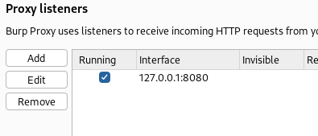

**7.15. INTERCEPTAR TRAFICO WEB**

- Ejecutaremos nuestra máquina virtual Metasploitable
- Abrir burpsuite en la sección Proxy>Proxy Settings veremos la ip en la cual esta burpsuite escuchando

- Ahora en nuestro navegador nos iremos a ajustes y buscamos proxy, nos metemos en sus ajustes y en Proxy Manual agregamos la ip y el puerto donde estaba burpsuite para redirigir el tráfico de datos(Esto solo funcionara para sitios HTTP; Para sitios HTTPS es necesario en el proxy del navegador agregar de igual forma la ip y puerto, y también tendremos que exportar los certificados de burpsuite e importarlos en el navegador para poder acceder de forma correcta a las peticiones)
- En nuestra maquina Metasploitable escribimos (ip a) para saber la ip y acceder a ella desde nuestro navegador
- Dentro de la página probaremos el Login de DVWA
- De regreso en burpsuite en la sección "Target" veremos un resumen de las rutas a las cuales hemos consultado dentro de cada dirección ip
- Con clic derecho sobre la ip de nuestra máquina virtual podemos rastrear el host (Add To Scope)

- En la siguiente opción de modificar el alcance seleccionaremos "Yes"
- Luego en la sección "Scope" modificaremos el alcance, en este caso solo tenemos la ip de la máquina virtual Metasploitable
