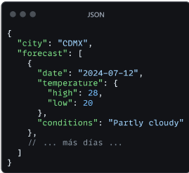
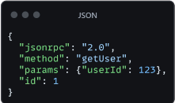
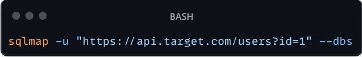
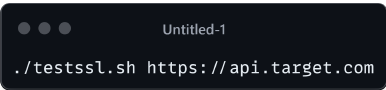

## PENTEST EN APIs

Una API(Interfaz de Programación de Aplicaciones) es un conjunto de reglas que permiten que diferentes softwares se comuniquen entre sí. Las APIs definen como las solicitudes deben ser hechas, que datos se pueden pedir y como se deben enviar las respuestas.

Las APIs permiten que los productos y servicios se comuniquen con otros sin necesidad de saber cómo están implementados. Esto simplifica el desarrollo de aplicaciones, ahorrando tiempo y dinero. Las APIs otorgan flexibilidad; simplifican el diseño, la administración y el uso de aplicaciones; y proporcionan oportunidades de innovación.

**CARACTERISTICAS CLAVE DE LAS APIS:**

- Abstracción: Ocultan la complejidad de los sistemas subyacentes
- Estandarización: Proporcionan una interfaz consistente para interactuar con diferentes sistemas
- **Eficiencia: Permite el acceso a funcionalidades especificas sin necesidad de comprender todo el sistema.**

**¿COMO FUNCIONA UNA API?**

Se puede resumir el funcionamiento básico en los siguientes pasos:

1. Solicitud del cliente: Una aplicación cliente realiza una solicitud a la API, generalmente a través de HTTP
2. Procesamiento de la solicitud: El servidor que aloja la API recibe la solicitud y la procesa.
3. Acceso a recursos: La API accede a los recursos necesarios (bases de datos, servicios externos, etc.) para cumplir con la solicitud
4. Preparación de la respuesta: La API prepara los datos en el formato adecuado (generalmente JSON o XML)
5. Envío de la respuesta: El servidor envía la respuesta al cliente.
6. Procesamiento del cliente: LA aplicación cliente recibe y procesa la respuesta.

**EJEMPLO**

Supongamos una API de pronostico del tiempo. Un cliente podría hacer una solicitud GET a “X”.

El servidor procesaría la solicitud, consultaría sus bases de datos meteorológicas, prepararía un pronóstico para CDMX y devolvería una respuesta JSON como: <https://api.weather.com/forecast?city=CDMX>

### TIPOS DE APIs

Existen tipos de APIs y las vamos a separar en arquitectura y diferencias de acceso, para que podamos entender a fondo.

#### ARQUITECURA

##### REST (Representational State Transfer)

- - Utiliza métodos HTTP estándar (GET, POST, PUT, DELETE, etc.)
    - Stateless: Cada solicitud contiene toda la información necesaria
    - Recursos identificados por URLs
    - Formato de datos común: JSON, a veces XML
    - Ejemplo: Para obtener información del usuario con ID 123

GET /api/users/123

##### SOAP (Simple Object Access Protocol)

- Protocolo basado en XML
- Independiente del protocolo de transporte (puede usar HTTP, SMTP, etc.)
- Tiene un conjunto de reglas estricto
- Mejor para operaciones complejas y entornos empresariales
- Ejemplo de mensaje SOAP:

##### GrapQL

- Lenguaje de consulta para APIs
- Permite a los clientes solicitar exactamente los datos que necesitan
- Un solo endpoint para todas las operaciones
- Fuertemente tipado
- Ejemplo de consulta GraphQL:

##### RPC (Remote Procedure Call)

- Permite la ejecución de procedimientos en sistemas remotos
- Puede ser basado en XML (XML-RPC) o JSON (JSON-RPC)
- Mas simples que SOAP, pero menos flexible que REST
- Ejemplo de llamada JSON-RPC:

#### ACCESO

##### APIs publicas

- Accesibles para cualquier desarrollador
- Pueden requerir una clave de API para el control de acceso
- Ejemplo: API de Twitter, Google Maps API

##### APIs privadas

- Uso interno dentro de una organización
- No accesibles fuera de la red de la empresa
- Ejemplo: API interna para comunicación entre microservicios

##### APIs de socios

- Acceso limitado a socios comerciales específicos
- Requieren autenticación y autorización estrictas
- Ejemplo: APIs de integración B2B

#### ARQUITECTURA Y DESARROLLO

Si quieres saber cómo vulnerar algo necesitas conocer primero su estructura, así que aquí se explicara la arquitectura y desarrollo de las APIs

##### Arquitectura basada en recursos

- Cada recurso es identificable y accesible mediante una URL única
- Los recursos están organizados jerárquicamente
- Ejemplo: para la colección de usuarios, para un usuario especifico **/users/users/123**

##### Diseño de endpoints

- Use sustantivos en plural para colecciones: **/articles/users**
- Use identificadores únicos para recursos específicos: **/articles/789/users/123**
- Agrupe recursos relacionados: **/users/123/posts**
- Use parámetros de consulta para filtrado y paginación: **/articles?category=tech&page=2**

##### Métodos de HTTP

- **GET:** Recuperar recursos
- **POST:** Crear nuevos recursos
- **PUT:** Actualizar recursos existentes (reemplazando completamente)
- **PATCH:** Actualizar parcialmente recursos existentes
- **DELETE:** Eliminar recursos

##### Formatos de datos

###### JSON (notación de objetos JavaScript)

- - - Ligero y fácil de leer
      - Soportado por la mayoría de los lenguajes de programación
      - Ejemplo:
      

###### XML (Lenguaje de Marcado Extensible)

- - - Mas verboso que JSON, pero más estructurado
      - Útil para datos complejos y anidados
      - Ejemplo:
      

###### Autenticación y autorización

- - - **QAuth 2.0**: Protocolo de autorización estándar de la industria
      - **API Keys:** Claves únicas para identificar y autorizar clientes
      - **JWT** (JSON Web Token): Tokens compactos y seguros para transmitir información entre partes
      - **Basic Auth:** Autenticación simple usando nombre de usuario y contraseña

###### Versionado de APIs

- - - Versionado en la URL: **/api/v1/users**
      - Versión en el header: **application/vnd.company.v1+json**
      - Versionado por parámetro: **/api/users?version=1**

###### Documentación

- - - **OpenAPI (anteriormente Swagger):** Especificación para documentar APIs RESTful
      - **API Blueprint**: Lenguaje de alto nivel para describir APIs
      - **RAML (RESTful API Modeling Language):** Lenguaje basado en YAML para descubrir APIs RESTful

#### FALLOS FRECUENTES EN APIs

Una vez que se tenga experiencia en esto, te podrás dar cuenta de que los métodos de explotación se basan mayormente en estas fallas por parte de los desarrolladores.

##### Exposición de información sensible

- - **Descripción**

Las APIs pueden revelar inadvertidamente datos sensibles en sus respuestas

- - **Causas comunes**
        - Falta de filtrado de datos sensibles
        - Respuestas de error demasiado detalladas
        - Metadata expuesta innecesariamente
    - **Ejemplo**

Una API de perfil de usuario que incluye el número de seguridad social completo en la respuesta

- - **Mitigación**

Implementar un filtrado cuidadoso de datos sensible antes de enviar respuestas

##### Autenticación débil

- - **Descripción**

Mecanismos de autenticación que pueden ser fácilmente eludidos o comprometidos

- - **Causas comunes**
        - Uso de métodos de autenticación obsoletos
        - Implementación incorrecta de protocolos de autenticación
        - Falta de protección contra ataques de fuerza bruta
    - **Ejemplo**

Una API que utiliza Basic Auth sobre HTTP sin SSL/TLS

- - **Mitigación**

Implementar métodos de autenticación como OAuth 2.0 con JWT, usar HTTPS, implementar bloqueo de cuentas después de múltiples intentos fallidos.

##### Autorización inadecuada

- - **Descripción**

Fallas en el control de acceso que permiten a los usuarios realizar acciones o acceder a datos más allá de sus permisos

- - **Causas comunes**
        - Comprobaciones de autorización insuficientes
        - Confianza excesiva en los tokens de cliente
        - Falta de segregación de roles
    - **Ejemplo**

Un usuario regular puede acceder a la ruta /api/admin/users que debería estar restringida solo a administradores

- - **Mitigación**

Implementar controles de acceso granulares, validar permisos en el servidor para cada solicitud

##### Inyección de datos maliciosos

- - **Descripción**

Inserción de código malicioso a través de entradas de usuario no sanitizadas

- - **Causas comunes**
        - SQL Injection
        - NoSQL Injection
        - Command Injection
        - XML External Entity (XXE) Injection
    - **Ejemplo**

Entrada maliciosa: username=admin’— Query vulnerable:

SELECT \* FROM users WHERE username = ‘admin’ AND password = ‘password’

- - **Mitigación**

Usar consultas parametrizadas, validar y Sanitizar todas las entradas de usuario, implementar el principio de menor privilegio en las conexiones de base de datos.

##### Ataques de denegación de servicio (DoS)

- - **Descripción**

Intentos de hacer que la API sea inaccesible sobrecargando el sistema.

- - **Causas comunes**
        - Ataques de inundación (flood attacks)
        - Ataques de slowloris
        - Ataques de amplificación
    - **Ejemplo**

Enviar miles de solicitudes por segundo a un endpoint de API no protegido.

- - **Mitigación**

Implementar rate limiting, usar servicios de mitigación de DDoS, optimizar el rendimiento de la API

##### Man-in-the-middle attacks

- - **Descripción**

Interceptación de comunicaciones entre el cliente y la API

- - **Causas comunes**
        - Falta de encriptación (no usar HTTPS)
        - Certificados SSL/TLS mal configurados
        - Vulnerabilidades en el protocolo de comunicación
    - **Ejemplo**

Un atacante en una red Wi-Fi publica intercepta las credenciales enviadas a una API que no usa HTTPS

- - **Mitigación**

Usar HTTPS para todas las comunicaciones, implementar certificate pinning, usar protocolos de comunicación seguros.

##### Manipulación de parámetros

- - **Descripción**

Modificación de parámetros de solicitud para obtener acceso no autorizado o alterar la lógica de la aplicación

- - **Causas comunes**
        - Tampering de parámetros de URL
        - Manipulación de cuerpo de solicitud
        - Alteración de headers HTTP
    - **Ejemplo**

Cambiar el ID de usuario en la URL de /api/user/123/profile a /api/user/456/profile para acceder al perfil de otro usuario

- - **Mitigación**

Validar y autorizar todas las entradas del usuario en el servidor, no confiar en los datos enviados por el cliente

##### Configuraciones incorrectas

- - **Descripción**

Errores en la configuración de la API o su infraestructura que crean vulnerabilidades

- - **Causas comunes**
        - Configuraciones por defecto no seguras
        - Errores humanos en la configuración
        - Falta de hardening de servidores
    - **Ejemplo**

Dejar habilitado el modo de depuración en un entorno de producción, exponiendo información sensible en los mensajes de error

- - **Mitigación**

Implementar listas de verificación de seguridad, realizar auditorías regulares, usar herramientas de escaneo de configuración.

### METODOLOGIA DE PENTESTING EN APIs

#### Reconocimiento

**Objetivo:** Recopilar toda la información posible sobre la API objetivo

**Técnicas:**

- **Identificación de endpoints**
  - Analizar la documentación de la API (si está disponible)
  - Utilizar herramientas de descubrimiento como OWASP Amass, Sublist3r
  - Realizar fuzzing de directorios y parámetros
- **Ejemplo de comando**

#### Análisis de documentación

- Buscar archivos **Swagger/OpenAPI**
- Revisar guías de desarrolladores y documentación pública
- Examinar repositorios de código abierto relacionados

#### Enumeración de recursos

- - - Identificar los diferentes tipos de recursos expuestos (usuarios, productos, etc.)
      - Determinar la estructura de los datos devueltos
      - Mapear las relaciones entre diferentes endpoints

#### Fingerprinting

- - - Identificar tecnologías utilizadas (framework, lenguaje, servidor web)
      - Examinar headers de respuesta HTTP para obtener información

**EJEMPLO PARA OBTENER HEADERS:**

#### Análisis de trafico

- Capturar y analizar el tráfico de la API usando herramientas como Wireshark o Burp Suite.
- Identificar patrones en las solicitudes y respuestas.

**Análisis**

**Objetivo:** Evaluar a fondo la implementación y la lógica de la API.

**Técnicas**

1. **Revisión de mecanismos de autenticación**

- Identificar el tipo de autenticación utilizado (API Keys, OAuth, JWT, etc.,)
- Analizar el proceso de obtención y renovación de tokens
- Evaluar la fortaleza de las credenciales y tokens

1. **Evaluación de lógica de negocio**

- Mapear los flujos de trabajo y procesos de negocio
- Identificar posibles bypasses o ataques de lógica
- Buscar condiciones de carrera en operaciones criticas

1. **Análisis de manejo de datos**

- Evaluar la validación y sanitización de entradas
- Verificar el filtrado de datos sensibles en las respuestas
- Analizar la integridad de los datos en operaciones CRUD

1. **Revisión de control de acceso**

- Identificar los diferentes roles y niveles de acceso
- Probar el acceso horizontal y vertical entre recursos
- Verificar la aplicación consistente de controles de acceso

1. **Análisis de rate limiting y throttling**

- Determinar si existen límites de tasa
- Evaluar la efectividad de las medidas anti-automatizacion
- Buscar formas de eludir las restricciones implementadas

#### Explotación

Objetivo: Aprovechar las vulnerabilidades identificadas para demostrar el impacto potencial.

Técnicas

1. Pruebas de vulnerabilidades identificadas

- Explotar fallas de autenticación (Fuerza bruta, manipulación de tokens, etc.)
- Realizar ataques de inyección (SQL, NoSQL, XML, etc. )
- Explotar vulnerabilidades de deserialización

1. Ejemplo de payload SQL Injection

#### Escalada de privilegios

- Intentar acceder a funcionalidades de administrador desde cuentas normales
- Modificar tokens JWT para aumentar privilegios
- Explotar fallas en la lógica de negocio para obtener accesos no autorizados

#### Bypass de controles de seguridad

- Eludir validaciones del lado del cliente
- Manipular parámetros para saltarse restricciones
- Utilizar técnicas de ofuscación para evadir WAFs o filtros

#### Explotación de configuraciones incorrectas

- Aprovechar endpoints de depuración o desarrollo expuestos
- Explotar servicios mal configurados en el servidor
- Utilizar métodos HTTP no estándar o poco comunes

#### Ataques de denegación de servicio

- Realizar pruebas controladas de sobrecarga de endpoints
- Explotar operaciones costosas para agotar recursos del servidor
- Identificar puntos de congestión en la arquitectura de la API

#### Reporte

**Objetivo:** Documentar y comunicar los hallazgos de manera clara y efectiva

**Elementos clave**

1. **Documentación de hallazgos**

- Descripción detallada de cada vulnerabilidad
- Pasos para producir el problema
- Evidencias (screenshots, logs, payloads utilizados)

1. **Clasificación de vulnerabilidades**

- Utilizar un sistema de calificación estándar (ej. CVSS)
- Evaluar el impacto potencial de cada vulnerabilidad
- Priorizar los problemas basándose en su severidad y facilidad de explotación

1. **Recomendaciones de mitigación**

- Proporcionar soluciones específicas para cada vulnerabilidad
- Sugerir mejores prácticas generales de seguridad
- Incluir referencias a estándares y guías relevantes

1. **Resumen ejecutivo**

- Visión general de la evaluación y sus objetivos
- Resumen de los hallazgos más críticos
- Conclusiones y recomendaciones clave

1. **Informe técnico detallado**

- Metodología utilizada
- Herramientas y técnicas empleadas
- Descripción detallada de cada prueba realizada
- Análisis en profundidad de las vulnerabilidades encontradas

1. **Plan de remediación**

- Pasos concretos para abordar cada vulnerabilidad
- Estimación de esfuerzo y priorización
- Sugerencias para verificar la efectividad de las correcciones

### OWASP API SECURITY TOP 10

El OWASP API Security Top 10 es una lista estándar de las vulnerabilidades más críticas en APIs, las cuales detallare a continuación.

#### Broken Object Level Authorization

- **Descripción:** Falta de controles de acceso a nivel de objeto, permitiendo acceso no autorizado a datos
- **Ejemplo:** Un usuario puede acceder o modificar recursos de otro usuario cambiando el ID en la URL
- **Mitigación:** Implementar controles de autorización para cada objeto accedido a través de la API

#### Broken User Authentication

- **Descripción:** Implementación incorrecta de mecanismos de autenticación
- **Ejemplo:** Tokens JWT sin expiración o con algoritmos débiles
- **Mitigación**: Utilizar estándares probados como OAuth 2.0 con implementación adecuada

#### Excessive Data Exposure

- **Descripción:** La API devuelve más datos de los necesarios, confiando en que el cliente filtrara
- **Ejemplo:** Endpoint de perfil de usuario que incluye datos sensibles no necesarios para la vista
- **Mitigación:** Filtrar datos sensibles en el servidor antes de la respuesta

#### Lack of Resources & Rate Limiting

- **Descripción:** Ausencia de límites en la frecuencia o volumen de solicitudes
- **Ejemplo:** Un atacante puede realizar miles de solicitudes por segundo sin restricciones
- **Mitigación:** Implementar rate limiting y monitoreo de recursos.

#### Broken Function Level Authorization

- **Descripción:** Controles de autorización inadecuados para funciones especificas
- **Ejemplo:** Un usuario regular puede acceder a funciones administrativas
- **Mitigación:** Implementar controles de autorización granulares para cada función

#### Mass Assignment

- **Descripción:** Binding automático de parámetros de cliente a propiedades de objetos internos
- **Ejemplo:** Un atacante puede modificar campos que no deberían ser editables, como role: “admin”
- **Mitigación:** Implementar listas blancas de propiedades modificables

#### Security Misconfiguration

- **Descripción:** Configuraciones inseguras en cualquier parte del stack de la API
- **Ejemplo:** Servidores con configuraciones por defecto, CORS mal configurado
- **Mitigación:** Implementar procesos de hardening y revisión de configuraciones

#### Injection

- **Descripción:** Procesamiento no seguro de datos de entrada del usuario
- **Ejemplo:** SQL Injection, NoSQL Injection, Command Injection
- **Mitigación:** Validar, filtrar y Sanitizar todas las entradas del usuario

#### Improper Assets Management

- **Descripción:** Falta de inventario y gestión de los endpoints de la API
- **Ejemplo:** APIs obsoletas o de prueba expuestas en producción
- **Mitigación:** Mantener un inventario actualizado y eliminar endpoints innecesarios

#### Insufficient Logging & Monitoring

- **Descripción:** Falta de registro y monitoreo adecuados de actividades de la API
- **Ejemplo:** Ataques exitosos que pasan desapercibidos por falta de logs
- **Mitigación:** Implementar logging exhaustivo y sistemas de monitoreo en tiempo real

### TECNICAS DE PENTESTING EN APIs

Hablaremos de algunas técnicas especificas utilizadas en Pentesting de APIs

#### Reconocimiento y enumeración

Uso de herramientas como Nmap para escaneo de puertos:

- **Objetivo:** Identificar servicios y puertos abiertos relacionados con la API
- **Ejemplo de comando:**

- **Interpretación:** Analizar el resultado para identificar servicios web, bases de datos y otros componentes relevantes

##### Análisis de respuestas HTTP para identificar tecnologías

- **Objetivo:** Determinar el stack tecnológico utilizado por la API
- **Herramienta:** Wappalyzer (extensión de navegador) o whatweb (línea de comandos)
- **Ejemplo de comando:**

- **Análisis:** Investigar cualquier endpoint descubierto que no esté en la documentación oficial

##### Revisión de documentación publica y archivos de configuración

- **Objetivo:** Obtener información sobre la estructura y funcionalidad de la API
- **Técnicas:**
- Buscar archivos Swagger/OpenAPI(/swagger.json,/api-docs)
- Examinar repositorios públicos de código (GitHub, GitLab)
- Analizar respuestas de error para obtener pistas sobre la estructura interna

#### Autenticación y autorización

##### Pruebas de fuerza bruta en mecanismos de autenticación

- **Objetivo:** Identificar credenciales débiles o políticas de contraseñas inadecuadas
- **Herramientas:** Burp Suite Intruder o hydra
- **Ejemplo de comando con hydra:**

##### Verificación de gestión de sesiones

- **Objetivo:** Identificar debilidades en la gestión de sesiones y tokens
- **Técnicas:**
- Analizar la estructura de los tokens (ej. JWT) usando jwt.io
- Probar la revocación de tokens después del logout
- Verificar la expiración y renovación de tokens
- **Ejemplo:** Modificar un JWT valido para cambiar el rol de usuario a administrador

##### Comprobación de escalada de privilegios horizontal y vertical

- **Objetivo:** Identificar fallas que permitan acceder a recursos de otros usuarios o elevar privilegios
- **Técnicas:**
- Cambiar IDs de usuario en las solicitudes
- Intentar acceder a endpoints administrativos desde cuentas normales
- Modificar parámetros de rol o permisos en tokens o cookies
- **Ejemplo:** Cambiar user_id=123 a user_id=456 en la solicitud para acceder a datos de otro usuario

#### Inyección de datos

##### SQL Injection en parámetros de API

- **Objetivo:** Explotar consultas SQL mal sanitizadas para manipular la base de datos
- **Técnicas:** Insertar caracteres especiales y comandos SQL en los parámetros
- **Ejemplo de payload:**

- **Herramienta:** sqlmap para automatizar la detección y explotación
- **Comando de ejemplo con sqlmap:**

##### NoSQL Injection

- **Objetivo:** Explotar consultas NoSQL mal sanitizadas en base de datos como MongoDB
- **Técnicas:** Utilizar operadores especiales de NoSQL en los parámetros
- **Ejemplo de payload (MongoDB):**

- **Análisis:** Observar como la API maneja operadores especiales de NoSQL y ajustar los payloads en consecuencia

##### XML External Entity (XXE) Injection

- **Objetivo:** Explotar parsers XML mal configurados para leer archivos del sistema o realizar ataques SSRF
- **Técnicas:** Insertar entidades externas en payloads XML
- **Ejemplo de payload XXE:**

#### Manejo inadecuado de errores

##### Análisis de mensajes de error detallados

- **Objetivo:** Obtener información sensible a través de mensajes de error
- **Técnica:** Provocar errores intencionalmente y analizar las respuestas
- **Ejemplo:** Enviar tipos de datos incorrectos o valores fuera de rango
- **Análisis:** Buscar información como rutas de archivo, versiones de software, o fragmentos de código en los mensajes de error

##### Explotación de información revelada en stacktraces

- **Objetivo:** Obtener información sobre la estructura interna de la aplicación
- **Técnica:** Provocar excepciones no manejadas y analizar los stacktraces
- **Ejemplo:** Enviar payloads malformados o inesperados para causar errores
- **Análisis:** Identificar nombres de clases, métodos y líneas de código para mapear la estructura de la aplicación

##### Forzado de errores para obtener información adicional

- **Objetivo:** Descubrir endpoints o funcionalidades ocultas
- **Técnica:** Manipular parámetros y headers para provocar diferentes tipos de errores
- **Ejemplo:** Cambiar el método HTTP de GET a PUT en endpoints que no lo esperan
- **Análisis:** Buscar referencias a otros endpoints o funcionalidades en los mensajes de error

#### Configuraciones incorrectas

##### Revisión de headers HTTP de seguridad

- **Objetivo:** Identificar falta de headers de seguridad importantes
- **Técnica:** Analizar las respuestas HTTP en busca de headers de seguridad
- **Headers a verificar:**
- X-Frame-Options
- Content-Security-Policy
- Strict-Transport-Security
- X-Content-Type-Options
- **Herramienta:** securityheaders.com para un análisis rápido

##### Verificación de CORS (Cross-Origin Resource Sharing)

- **Objetivo:** Identificar configuraciones de CORS demasiado permisivas
- **Técnica:** Analizar el header Access-Control-Allow-Origin en las respuestas
- **Ejemplo de configuración insegura:**

- **Prueba:** Intentar realizar solicitudes desde diferentes orígenes y observar si son permitidas

##### Comprobación de SSL/TLS y sus versiones

- **Objetivo:** Identificar configuraciones SSL/TLS débiles o desactualizadas
- **Técnica:** ssllabs.com o testssl.sh para un análisis detallado
- **Ejemplo de comando con testssl.sh:**

- **Análisis:** Verificar el soporte de protocolos obsoletos (SSLv3, TLSv1.0) y cifrados débiles

##### Análisis de rate limiting y protección contra DoS

- **Objetivo:** Evaluar la resistencia de la API contra ataques de denegación de servicio
- **Técnica:** Realizar múltiples solicitudes rápidas y observar el comportamiento
- **Ejemplo:** Usar scripts personalizados o herramientas como Apache Bench (ab) para simular carga
- **Comando de ejemplo con ab:**

### HERRAMIENTAS PARA PENTESTING DE APIs

#### Herramientas de análisis

##### Postman

- **Descripción:** Plataforma de colaboración para el desarrollo de APIs que también sirve para pruebas de seguridad
- **Características principales:**
- Interfaz gráfica intuitiva para enviar solicitudes HTTP
- Capacidad para crear colecciones de pruebas
- Scripting pre-request y post-request
- Generación automática de documentación de API
- **Ejemplo de uso:**

1. Crear una nueva solicitud POST a <https://api.target.com/users>
2. Añadir un header de autenticación: Authorization: Bearer &lt;token&gt;
3. En el body, agregar un JSON: {“username”:”test”, “password”:”password123”}
4. Enviar la solicitud y analizar la respuesta

- **Ventajas para pentesting:**
- Fácil manipulación de parámetros y headers
- Capacidad para guardar y repetir solicitudes complejas
- Integración con Newman para automatización de pruebas

##### Swagger Inspector

- **Descripción:** Herramienta en línea para validar y probar APIs RESTful
- **Características principales:**
- Validación de especificaciones OpenAPI/Swagger
- Generación automática de documentación
- Pruebas de endpoints directamente desde la interfaz web
- **Ejemplo de uso:**

1. Pegar la URL de la especificación OpenAPI (ej. <https://api.target.com/swagger.json>)
2. Swagger Inspector cargara todos los endpoints disponibles
3. Seleccionar un endpoint y enviar una solicitud de prueba
4. Analizar la respuesta y la conformidad con la especificación

- **Ventajas para pentesting:**
- Rápida comprensión de la estructura de la API
- Identificación de endpoints y parámetros no documentados
- Fácil detección de discrepancias entre la documentación y la implementación real

##### SoapUI

- **Descripción:** Herramienta de pruebas funcionales para APIs SOAP y REST
- **Características principales:**
- Soporte para múltiples protocolos (SOAP, REST, GraphQL)
- Creación de casos de prueba complejos
- Simulación de servicios (mocking)
- Pruebas de carga y rendimiento
- **Ejemplo de uso:**

1. Crear un nuevo proyecto REST importando la definición de la API
2. Generar casos de prueba de seguridad automáticamente (en la versión Pro)
3. Ejecutar pruebas de inyección SQL en parámetros de consulta
4. Analizar los resultados y los logs generados

- **Ventajas para pentesting:**
- Amplia gama de pruebas de seguridad predefinidas
- Capacidad para personalizar y crear pruebas de seguridad complejas
- Integración con otras herramientas de seguridad

#### Herramientas de fuzzing

##### Burp Suite

- **Descripción:** Suite completa de herramientas para pruebas de seguridad en aplicaciones web y APIs
- **Características principales:**
- Proxy de intercepción
- Scanner de vulnerabilidades (Versión Pro)
- Intruder para ataques automatizados
- Repeater para manipulación y reenvío de solicitudes
- **Ejemplo de uso del Intruder para fuzzing:**

1. Capturar una solicitud a la API a través del proxy
2. Enviar la solicitud al Intruder
3. Configurar los puntos de inserción (parámetros a fuzzear)
4. Cargar una lista de payloads (ej. SQLi, XSS)
5. Iniciar el ataque y analizar las respuestas

- **Ventajas para pentesting:**
- Capacidades avanzadas de manipulación de solicitudes
- Potente motor de fuzzing con múltiples opciones de configuración
- Extensibilidad mediante plugins y extensiones personalizadas

##### OWASP ZAP (Zed Attack Proxy)

- **Descripción:** Herramienta de código abierto para encontrar vulnerabilidades en aplicaciones web y APIs
- **Características principales:**
- Proxy de intercepción
- Scanner de vulnerabilidades automatizado
- Fuzzer integrado
- Soporte para scripts personalizados
- **Ejemplo de uso del Fuzzer:**

1. Capturar una solicitud a la API
2. Hacer clic derecho y seleccionar “Fuzz”
3. Seleccionar el parámetro a fuzzear
4. Elegir o crear una lista de payloads
5. Ejecutar el fuzzing y analizar los resultados

- **Ventajas para pentesting:**
- Completamente gratuito y de código abierto
- Actualizaciones frecuentes con nuevas funcionalidades
- Amplia comunidad de usuarios y desarrolladores

##### Fuzzdb

- **Descripción:** Colección de patrones y payloads para fuzzing y pentesting
- **Características principales:**
- Amplia variedad de listas de palabras y payloads
- Categorización por tipo de ataque y tecnología
- Fácil integración con otras herramientas de fuzzing
- **Ejemplo de uso:**

- **Ventajas para pentesting:**
- Payloads específicos para diferentes tipos de vulnerabilidades
- Listas actualizadas regularmente con nuevos patrones de ataque
- Facilita la creación de pruebas de fuzzing exhaustivas

Integración con Newman para automatización de pruebas

#### Proxies de interceptación

Burp Suite (Mencionado anteriormente)

OWASP ZAP (Mencionado anteriormente)

##### Fiddler

- **Descripción:** Proxy de depuración web que puede ser utilizado para interceptar y modificar tráfico API
- **Características principales:**
- Interceptación y modificación de tráfico HTTP/HTTPS
- Soporte para dispositivos móviles y aplicaciones de escritorio
- Scripting extensible de FiddlerScript
- **Ejemplo de uso:**

1. Configurar Fiddler como proxy en el sistema o aplicación
2. Capturar tráfico hacia y desde la API objetivo
3. Utilizar el “Request Builder” para modificar y reenviar solicitudes
4. Analizar las respuestas en el inspector de Fiddler

- **Ventajas para pentesting:**
- Interfaz intuitiva y fácil de usar
- Potentes capacidades de scripting para automatización
- Excelente para analizar APIs en aplicaciones móviles y de escritorio

#### Herramientas especializadas en APIs

##### Astra’s API Security Testing Tool

- **Descripción:** Herramienta automatizada específicamente diseñada para pruebas de seguridad en APIS
- **Características principales:**
- Escaneo automático de vulnerabilidades en APIs
- Pruebas basadas en OWASP API Security Top 10
- Generación de informes detallados
- **Proceso de uso:**

1. Importar la especificación de la PI (Swagger/OpenAPI)
2. Configurar los parámetros de autenticación
3. Iniciar el escaneo automático
4. Revisar el informe de vulnerabilidades generado

- **Ventajas:**
- Enfoque especifico en seguridad de APIs
- Detección automatizada de vulnerabilidades comunes en APIs
- Integración con flujos de trabajo de CI/CD

##### APIsec

- **Descripción:** Plataforma de seguridad continua para APIs
- **Características principales:**
- Pruebas de seguridad automatizadas
- Generación de casos de prueba basados en la especificación de la API
- Integración con herramientas de CI/CD
- **Proceso de uso:**

1. Conectar APIsec a la infraestructura de CI/CD
2. Importar la especificación de la API
3. Configurar las políticas de seguridad
4. Ejecutar pruebas automáticas en cada despliegue

- **Ventajas:**
- Pruebas de seguridad continuas
- Detección temprana de vulnerabilidades en el ciclo de desarrollo
- Amplia cobertura de pruebas de seguridad específicas para APIs

##### 42Crunch API Security Testing

- **Descripción:** Plataforma que combina auditoria estática, seguridad dinámica y protección en tiempo de ejecución para APIs
- **Características principales:**
- Auditoria de especificaciones OpenAPI
- Escaneo dinámico de seguridad
- Firewall de API integrado
- **Proceso de uso:**

1. Cargar la especificación OpenAPI en la plataforma
2. Ejecutar la auditoria estática para identificar problemas de diseño
3. Configurar y ejecutar pruebas dinámicas
4. Implementar el firewall de API para protección en tiempo real

- **Ventajas:**
- Enfoque integral que cubre el ciclo de vida completo de la API
- Identificación de problemas tanto en el diseño como en la implementación
- Capacidades de protección en tiempo real

### MEJORES PRACTICAS Y MITIGACION

#### Implementación de autenticación fuerte

- Utilizar OAuth 2.0 y OpenID Connect para autenticación y autorización
- Implementar autenticación de dos factores (2FA) para cuentas criticas
- Usar tokens JWT (JSON Web Tokens) con las siguientes consideraciones:
- Establecer tiempos de expiración cortos (ej. 15 min)
- Incluir claims como ‘iat’ (issued at) y ‘nbf’ (not before)
- Firmar tokens con algoritmos seguros (ej. RS256)
- Ejemplo de configuración de JWT en Node.js con jsonwebtoken:

#### Uso de HTTPS para todas las comunicaciones

- Forzar HTTPS en todos los endpoints de la API
- Implementar HSTS (HTTP Script Transport Security)
- Configurar certificados SSL/TLS correctamente y mantenerlos actualizados
- Ejemplo de configuración de HSTS en un servidor Node.js con Express:

#### Implementación de rate limiting y throttling

- Limitar el número de solicitudes por usuario/IP en un periodo de tiempo
- Implementar retrasos crecientes para solicitudes repetidas
- Utilizar headers como ‘X-RateLimit-Limit’ y ‘X-RateLimit-Remaining’ para informar al cliente
- Ejemplo de implementación de rate limiting con Express:

#### Validación y sanitización de entradas de usuario

- Validar todos los parámetros de entrada en el servidor
- Implementar listas blancas para valores permitidos
- Sanitizar datos antes de usarlos en consultas o respuestas
- Ejemplo de validación en Node.js con Joli:

#### Principio de mínimo privilegio en autorizaciones

- Asignar los mínimos permisos necesarios a cada rol de usuario
- Implementar controles de acceso granulares a nivel de recurso
- Revisar y editar periódicamente los permisos asignados

#### Implementación de controles de seguridad

Web Application Firewalls (WAF) configurados para APIs:

- Implementar reglas específicas para proteger endpoints de API
- Configurar el WAF para detectar y bloquear patrones de ataque comunes
- Mantener las reglas del WAF actualizadas con las últimas amenazas
- Ejemplo de regla ModSecurity para proteger contra inyección SQL:

#### Monitoreo continuo y logging

- Implementar logging detallado de todas las actividades de la API
- Utilizar herramientas de SIEM (Security Information and Event Management) para análisis en tiempo real
- Configurar alertas para actividades sospechosas y anómalas
- Ejemplo de logging en Node.js con Winston:

#### Gestión segura de secretos y claves

- Utilizar sistemas de gestión de secretos como HashiCorp Vault o AWS Secrets Manager
- Rotar regularmente las claves y secretos
- Nunca almacenar secretos en código fuente o sistemas de control de versiones
- Ejemplo de uso de Vault en Node.js:

**Actualizaciones regulares y gestión de parches:**

- Mantener todas las dependencias y bibliotecas actualizadas
- Implementar un proceso de gestión de parches para aplicar actualizaciones de seguridad rápidamente
- Utilizar herramientas de análisis de dependencias para identificar vulnerabilidades conocidas
- Ejemplo de uso de npm Audit en un proyecto Node.js:

#### Implementación de CORS adecuada

- Configurar CORS (Cross-Origin Resource Sharing) de manera restrictiva
- Especificar explícitamente los orígenes permitidos
- Evitar el uso de ‘Access-Control-Allow-Origin: \*’ en APIs que requieran autenticación.
- Ejemplo de configuración de CORS en Express:

#### Implementación de Content Security Policy (CSP)

- Definir políticas estrictas para prevenir ataques XSS y de inyección de contenido
- Utilizar nonces o hashes para scripts inline cuando sea necesario
- Monitorear y ajustar la CSP basándose en los reportes de violaciones.
- Ejemplo de CSP para una API:

#### Implementación de seguridad en profundidad

- Aplicar múltiples capas de seguridad en lugar de confiar en una sola medida
- Implementar controles de seguridad tanto a nivel de red como de aplicación
- Utilizar el principio de "defensa en profundidad" en toda la arquitectura de la API
