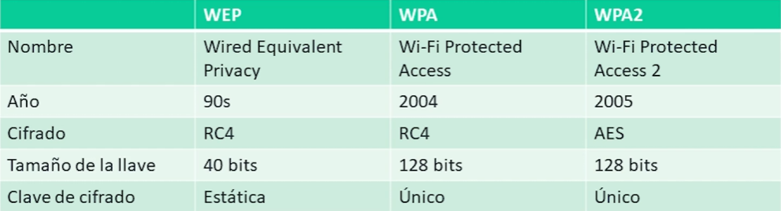

# FORMAS DE ATACAR UNA RED

## WIRESHARK SIMPLIFICADO

Herramienta de rastreo usada para comprender un protocolo, depurar un problema de red, analizar el tráfico, utiliza Libcap en Linux y Winpcap en Windows y su secreto está en utilizar los filtros Capturar y Mostrar.

[PRACTICA WIRESHARK](../laboratorio/wireshark-lab.md#laboratorio-1-interaccion-basica)

## COMO FUNCIONA LA EXPLORACION DE PUERTOS

El escaneado de puertos es el proceso de verificar los puertos abiertos (TCP o UDP)

- Métodos de escaneo de puertos.
    - **Connect** el cual está basado en el mecanismo de saludo TCP, implica enviar un paquete de saludo TCP completo a cada puerto objetivo, este escaneo completa el 3-Way TCP Handshake y se usa para determinar si un puerto especifico está abierto.
    - **SYN/Stealth** el cual implica el envío de paquetes de envío a varios puertos en la máquina objetivo, no completa el 3-Way TCP Handshake, se considera más sigiloso y discreto que el Connect Scan y es utilizado para descubrir puertos abiertos sin dejar rastro en los logs del objetivo.
    - Escaneo UDP, mientras que TCP está orientado a la conexión, UDP es sin estado por lo que no implica el establecimiento de conexión por 3-Way siendo diferente su escaneo, en este los paquetes se envían a los puertos objetivo sin esperar una respuesta de confirmación de los puertos cerrados, lo que dificulta la detección precisa de los puertos abiertos, por lo que, debido a la falta de respuesta en los puertos cerrados, el escaneo UDP puede ser más lento y menos fiable que el TCP.
- Nmap es una gran herramienta de código abierto para escanear redes, utilizada para descubrir dispositivos, puertos abiertos y servicios en una red, ofrece técnicas de escaneo TCP, UDP y detección de SO. Ampliamente utilizada en seguridad informática y administración de redes.
- Consideraciones sobre el tráfico al usar esta herramienta es que estos mil puertos predeterminados pueden generar hasta 70KB de tráfico dependiendo de la configuración de la red y de la respuesta de los servicios en los puertos escaneados. Sin embargo, si se amplía el escaneo para incluir todos los 65,536 puertos posibles, el tráfico generado puede ser mucho mayor, alcanzando alrededor de 4MB solo para un host.

Por lo que ahora ¿Qué tal el escaneo de una red de clase C con 254 hosts, o incluso de una red clase B? Pues imaginando que se escanean todos los puertos de todos los Host en una red de clase C podemos llegar a generar un tráfico de alrededor 1GB por lo que hacer un escaneo completo en una red clase B imagina la cantidad de tráfico que se estaría generando, conteniendo hasta 65,536 hosts.

[PRACTICA DE NMAP](../laboratorio/nmap-lab.md#laboratorio-1-escaneo-local-de-puertos)

## EJECUTAR ATAQUES MAN-IN-THE-MIDDLE

CIRCUNSTANCIAS NORMALES DE UNA CONEXIÓN

CIRCUNSTANCIAS ANORMALES DE UNA CONEXIÓN (ARP SPOOFED)

[PRACTICA MIM](../laboratorio/ettercap-lab.md#laboratorio-1-man-in-the-middle)

### **REALIZAR UN ATAQUE DE SUPLANTACION DE DNS**

La suplantación DNS, es una técnica utilizada para manipular las respuestas del sistema de nombres de dominio (DNS) de manera que los usuarios sean dirigidos a direcciones IP incorrectas o maliciosas cuando intentan accedes a un sitio web.

Su funcionamiento básico implica interceptar y falsificar las respuestas DNS enviadas desde un servidor DNS legítimo, una vez que el atacante ha logrado falsificar las respuestas DNS puede redirigir a los usuarios a sitios web falsos que se asemejan a sitios legítimos. Esto puede conducir a diversas formas de ataques como phishing, robo de credenciales, malware, entre otros.

[PRACTICA SPOOFING](../laboratorio/ettercap-lab.md#laboratorio-2-dns-spoofing)

### **PLANIFICAR ATAQUES DOS Y DDOS**

Estos ataques son técnicas utilizadas para inundar un sistema, red o servicio con tráfico malicioso con el objetivo de hacerlo inaccesible para los usuarios legítimos.

Los ataques **DOS** son ataques desde un solo dispositivo comprometido que envía una cantidad abrumadora de tráfico a un objetivo específico como un servidor web con el objetivo de sobrecargarlo y hacerlo inaccesible para los usuarios legítimos.

Los ataques **DDOS** son ataques desde múltiples dispositivos comprometidos conocidos como botnets que coordinan esfuerzos para enviar grandes volúmenes de tráfico malicioso hacia un objetivo específico.

CLASIFICACIONES DE LOS ATAQUES DDOS:

- **Basados en volumen:** Centrados en inundar la red o servicio objetivo con una gran cantidad de tráfico. Ejemplos incluyen ataques SYN, inundación UDP, inundación ICMP, etc.
- **Basados en protocolos:** Estos explotan debilidades en los protocolos de red para sobrecargar los recursos del objetivo. Ejemplos incluyen ataques de amplificación de DNS, ataques NTP amplificados, etc.
- **Ataques a la capa de aplicación:** Estos ataques se dirigen a las vulnerabilidades de las aplicaciones y servicios específicos en lugar de abrumar la infraestructura de red. Ejemplos incluyen ataques de inundación HTTP, ataques de SQL injection, ataques de Cross-Site Scriptin (XSS), etc.

## ATACAR REDES INALAMBRICAS

El ataque a redes inalámbricas es un tipo de ciberataque dirigido a redes Wifi para comprometer su seguridad y obtener acceso no autorizado a la red o a la información transmitida a través de ella. Los atacantes pueden aprovechar diferentes vulnerabilidades en los protocolos de seguridad utilizados por las redes Wifi para llevar a cabo estos ataques.

**COMPARACION DE WPAs**

### HERRAMIENTAS DE HACKING

- WPA/WPA2
  - **airmon-ng**: Pone la tarjeta inalámbrica en modo monitor
  - **airdump-ng**: Guarda el tráfico aéreo en archivos PCAP y muestra información sobre las redes
  - **aireplay-ng**: Inyector de paquetes WEP
  - **Fern WiFi**: Crackea y recupera claves WEP/WPA/WPS y también ejecuta otros ataques de red basados en redes inalámbricas o Ethernet
  - **Reaver**: Realiza ataques de fuerza bruta contra los PIN de registro de Wifi Protected Setup (WPS) para recuperar las contraseñas WPA/WPA2

### WEP CRACKING

WEP fue uno de los primeros protocolos de seguridad utilizados en redes WiFi. Sin embargo, se descubrieron múltiples vulnerabilidades en su implementación que permiten a los atacantes interceptar y descifrar el tráfico de la red con relativa facilidad. Como resultado, se considera inseguro y obsoleto, y no se recomienda su uso.

[PRACTICA WEP CRACK](../laboratorio/ataques-redes-inalambricas-lab.md#laboratorio-1-fern-wifi-cracker)

### WPA Y WPA2 CRACKING

WPA fue desarrollado como una mejora de seguridad sobre WEP. Utiliza un cifrado más robusto y técnicas de autenticación más sólidas para proteger las comunicaciones inalámbricas. Sin embargo, algunas versiones tempranas de WPA también han sido vulnerables a ataques de fuerza bruta y otros métodos de explotación.

WPA2 es la versión más segura y ampliamente utilizada de los protocolos de seguridad WiFi en la actualidad. Utiliza el cifrado AES (Advanced Encryption Standard) y el protocolo de autenticación de claves de precompartidas (PSK) para garantizar la seguridad de la red. Aunque WPA2 es generalmente seguro, se han descubierto algunas vulnerabilidades, como el ataque KRACK (Key Reinstallation Attack), que afectó a algunas implementaciones de WPA2.

[PRACTICA WPA & WPA2 CRACK](../laboratorio/ataques-redes-inalambricas-lab.md#laboratorio-2-fuerza-bruta)

### WPS CRACKING

WPS es un protocolo diseñado para simplificar el proceso de configuración y conexión de dispositivos a redes WiFi. Sin embargo, se han descubierto múltiples vulnerabilidades en WPS que permiten a los atacantes obtener acceso no autorizado a la red WiFi utilizando métodos como el ataque de PIN WPS y el ataque de fuerza bruta. Por esta razón, se recomienda desactivar WPS en los enrutadores y dispositivos WiFi para mejorar la seguridad de la red.

[PRACTICA WPS CRACK](../laboratorio/ataques-redes-inalambricas-lab.md#laboratorio-3-wps-crack)

